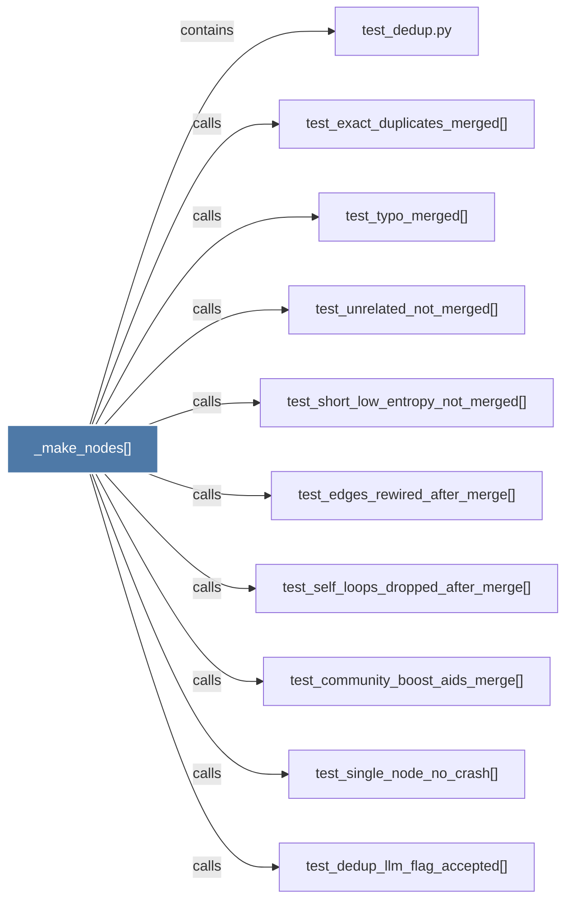

# _make_nodes()

> [!info] Properties
> **File Type**: code
> **Community**: [[_COMMUNITY_Community None|Community None]]
> **Degree**: 10

## Architecture Graph


## Outbound Connections
- [[test_community_boost_aids_merge()]] - `calls` [EXTRACTED]
- [[test_dedup.py]] - `contains` [EXTRACTED]
- [[test_dedup_llm_flag_accepted()]] - `calls` [EXTRACTED]
- [[test_edges_rewired_after_merge()]] - `calls` [EXTRACTED]
- [[test_exact_duplicates_merged()]] - `calls` [EXTRACTED]
- [[test_self_loops_dropped_after_merge()]] - `calls` [EXTRACTED]
- [[test_short_low_entropy_not_merged()]] - `calls` [EXTRACTED]
- [[test_single_node_no_crash()]] - `calls` [EXTRACTED]
- [[test_typo_merged()]] - `calls` [EXTRACTED]
- [[test_unrelated_not_merged()]] - `calls` [EXTRACTED]

## Inbound Dependencies
> [!abstract]- Files that link here
```dataview
LIST
FROM [[_make_nodes()]]
```

#graphify/code #graphify/EXTRACTED #community/Community_None