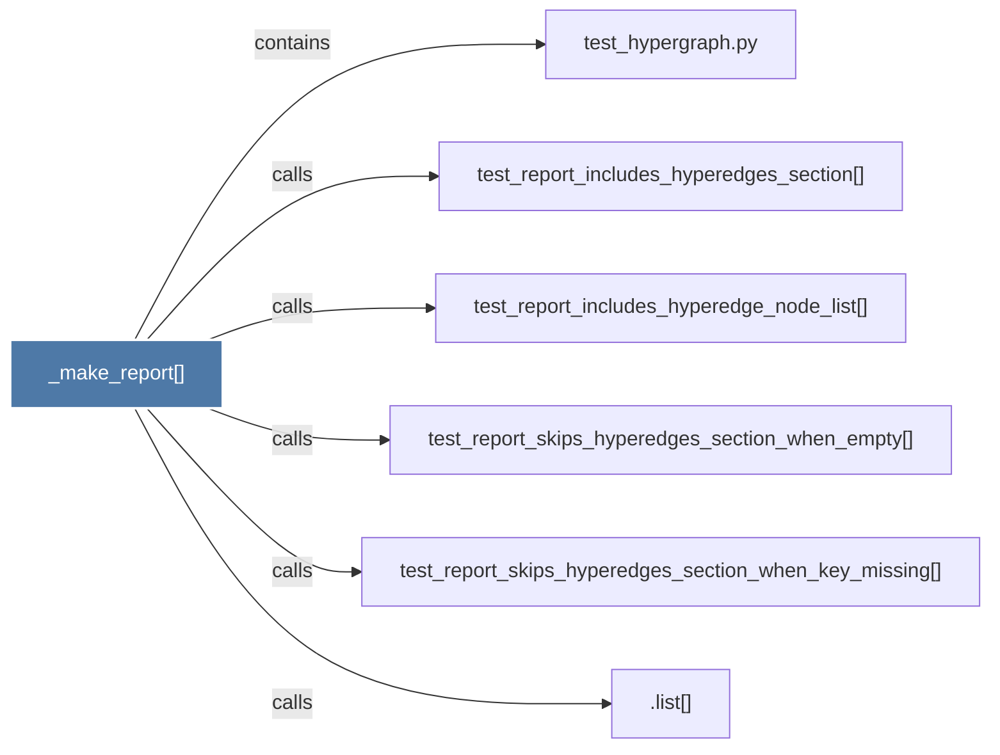

# _make_report()

> [!info] Properties
> **File Type**: code
> **Community**: [[_COMMUNITY_Community None|Community None]]
> **Degree**: 6

## Architecture Graph


## Outbound Connections
- [[.list()]] - `calls` [INFERRED]
- [[test_hypergraph.py]] - `contains` [EXTRACTED]
- [[test_report_includes_hyperedge_node_list()]] - `calls` [EXTRACTED]
- [[test_report_includes_hyperedges_section()]] - `calls` [EXTRACTED]
- [[test_report_skips_hyperedges_section_when_empty()]] - `calls` [EXTRACTED]
- [[test_report_skips_hyperedges_section_when_key_missing()]] - `calls` [EXTRACTED]

## Inbound Dependencies
> [!abstract]- Files that link here
```dataview
LIST
FROM [[_make_report()]]
```

#graphify/code #graphify/EXTRACTED #community/Community_None