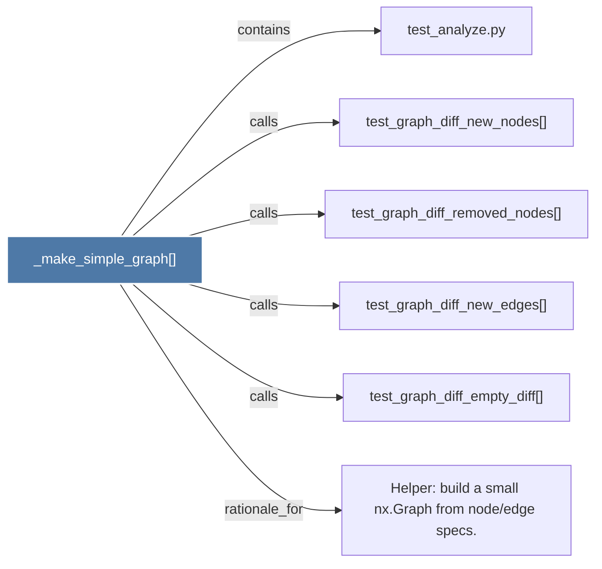

# _make_simple_graph()

> [!info] Properties
> **File Type**: code
> **Community**: [[_COMMUNITY_Community None|Community None]]
> **Degree**: 6

## Architecture Graph


## Outbound Connections
- [[Helper build a small nx.Graph from nodeedge specs.]] - `rationale_for` [EXTRACTED]
- [[test_analyze.py]] - `contains` [EXTRACTED]
- [[test_graph_diff_empty_diff()]] - `calls` [EXTRACTED]
- [[test_graph_diff_new_edges()]] - `calls` [EXTRACTED]
- [[test_graph_diff_new_nodes()]] - `calls` [EXTRACTED]
- [[test_graph_diff_removed_nodes()]] - `calls` [EXTRACTED]

## Inbound Dependencies
> [!abstract]- Files that link here
```dataview
LIST
FROM [[_make_simple_graph()]]
```

#graphify/code #graphify/EXTRACTED #community/Community_None