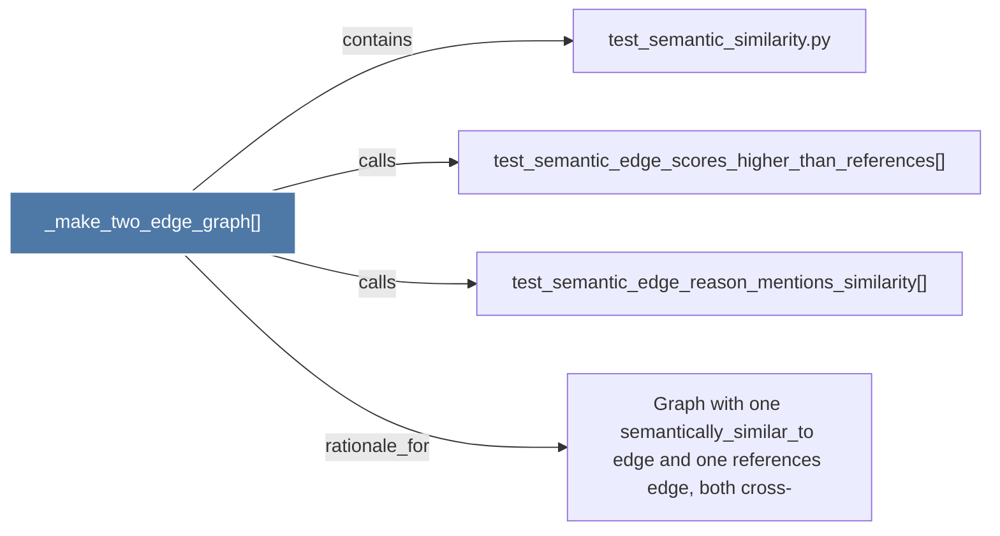

# _make_two_edge_graph()

> [!info] Properties
> **File Type**: code
> **Community**: [[_COMMUNITY_Community None|Community None]]
> **Degree**: 4

## Architecture Graph


## Outbound Connections
- [[Graph with one semantically_similar_to edge and one references edge, both cross-]] - `rationale_for` [EXTRACTED]
- [[test_semantic_edge_reason_mentions_similarity()]] - `calls` [EXTRACTED]
- [[test_semantic_edge_scores_higher_than_references()]] - `calls` [EXTRACTED]
- [[test_semantic_similarity.py]] - `contains` [EXTRACTED]

## Inbound Dependencies
> [!abstract]- Files that link here
```dataview
LIST
FROM [[_make_two_edge_graph()]]
```

#graphify/code #graphify/EXTRACTED #community/Community_None