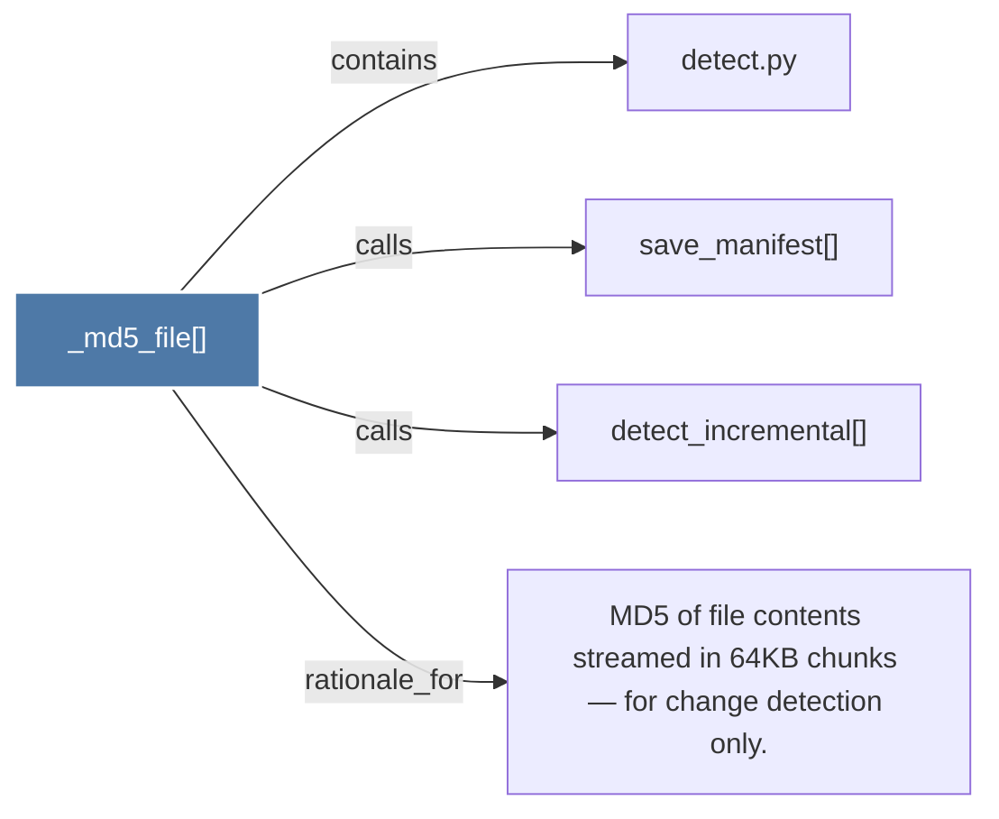

# _md5_file()

> [!info] Properties
> **File Type**: code
> **Community**: [[_COMMUNITY_Community None|Community None]]
> **Degree**: 4

## Architecture Graph


## Outbound Connections
- [[MD5 of file contents streamed in 64KB chunks — for change detection only.]] - `rationale_for` [EXTRACTED]
- [[detect.py]] - `contains` [EXTRACTED]
- [[detect_incremental()]] - `calls` [EXTRACTED]
- [[save_manifest()]] - `calls` [EXTRACTED]

## Inbound Dependencies
> [!abstract]- Files that link here
```dataview
LIST
FROM [[_md5_file()]]
```

#graphify/code #graphify/EXTRACTED #community/Community_None