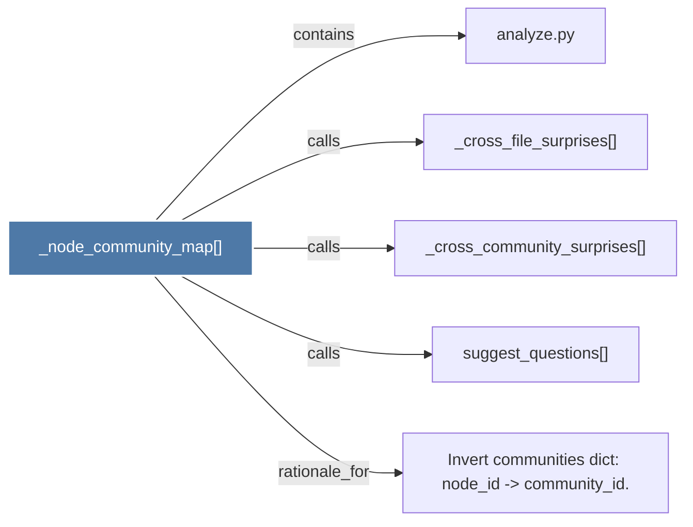

# _node_community_map()

> [!info] Properties
> **File Type**: code
> **Community**: [[_COMMUNITY_Community None|Community None]]
> **Degree**: 5

## Architecture Graph


## Outbound Connections
- [[Invert communities dict node_id - community_id._1]] - `rationale_for` [EXTRACTED]
- [[_cross_community_surprises()_1]] - `calls` [EXTRACTED]
- [[_cross_file_surprises()_1]] - `calls` [EXTRACTED]
- [[analyze.py_1]] - `contains` [EXTRACTED]
- [[suggest_questions()_1]] - `calls` [EXTRACTED]

## Inbound Dependencies
> [!abstract]- Files that link here
```dataview
LIST
FROM [[_node_community_map()_1]]
```

#graphify/code #graphify/EXTRACTED #community/Community_None