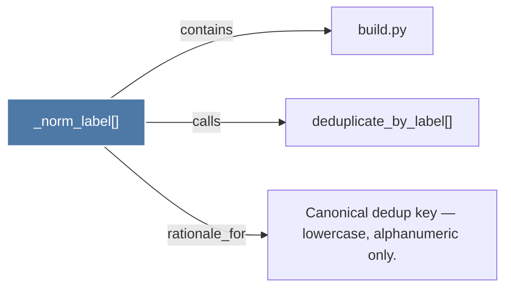

# _norm_label()

> [!info] Properties
> **File Type**: code
> **Community**: [[_COMMUNITY_Community None|Community None]]
> **Degree**: 3

## Architecture Graph


## Outbound Connections
- [[Canonical dedup key — lowercase, alphanumeric only.]] - `rationale_for` [EXTRACTED]
- [[build.py]] - `contains` [EXTRACTED]
- [[deduplicate_by_label()]] - `calls` [EXTRACTED]

## Inbound Dependencies
> [!abstract]- Files that link here
```dataview
LIST
FROM [[_norm_label()]]
```

#graphify/code #graphify/EXTRACTED #community/Community_None