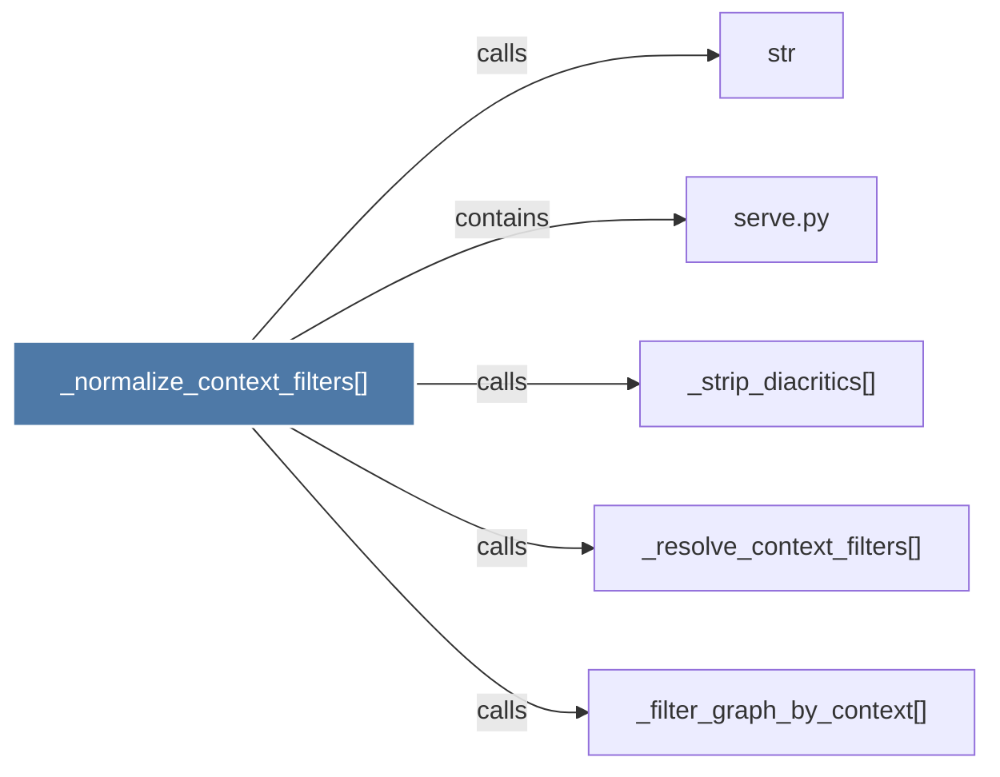

# _normalize_context_filters()

> [!info] Properties
> **File Type**: code
> **Community**: [[_COMMUNITY_Community None|Community None]]
> **Degree**: 5

## Architecture Graph


## Outbound Connections
- [[_filter_graph_by_context()]] - `calls` [EXTRACTED]
- [[_resolve_context_filters()]] - `calls` [EXTRACTED]
- [[_strip_diacritics()_1]] - `calls` [EXTRACTED]
- [[serve.py]] - `contains` [EXTRACTED]
- [[str]] - `calls` [INFERRED]

## Inbound Dependencies
> [!abstract]- Files that link here
```dataview
LIST
FROM [[_normalize_context_filters()]]
```

#graphify/code #graphify/EXTRACTED #community/Community_None