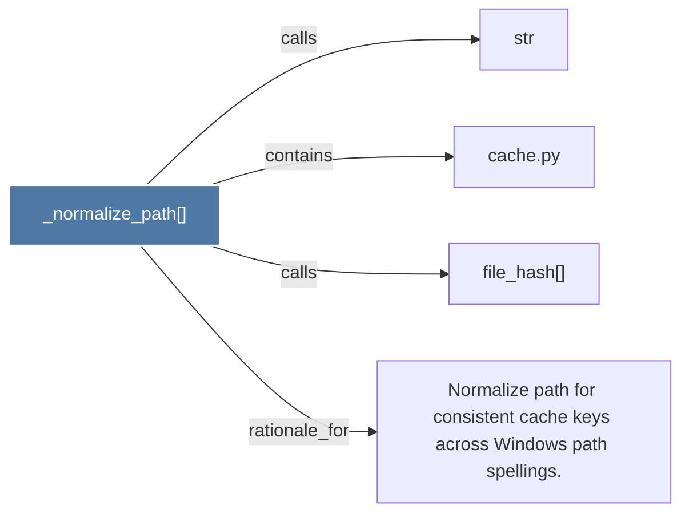

# _normalize_path()

> [!info] Properties
> **File Type**: code
> **Community**: [[_COMMUNITY_Community None|Community None]]
> **Degree**: 4

## Architecture Graph


## Outbound Connections
- [[Normalize path for consistent cache keys across Windows path spellings.]] - `rationale_for` [EXTRACTED]
- [[cache.py]] - `contains` [EXTRACTED]
- [[file_hash()]] - `calls` [EXTRACTED]
- [[str]] - `calls` [INFERRED]

## Inbound Dependencies
> [!abstract]- Files that link here
```dataview
LIST
FROM [[_normalize_path()]]
```

#graphify/code #graphify/EXTRACTED #community/Community_None