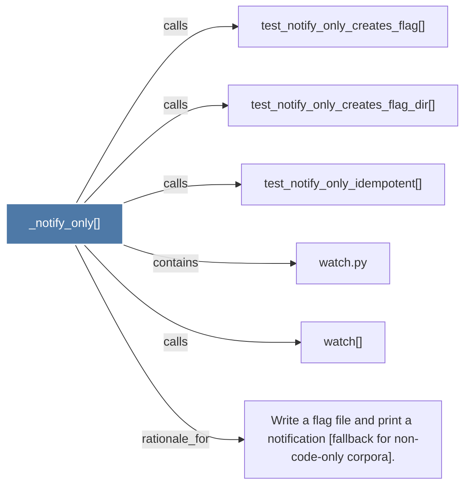

# _notify_only()

> [!info] Properties
> **File Type**: code
> **Community**: [[_COMMUNITY_Community None|Community None]]
> **Degree**: 6

## Architecture Graph


## Outbound Connections
- [[Write a flag file and print a notification (fallback for non-code-only corpora).]] - `rationale_for` [EXTRACTED]
- [[test_notify_only_creates_flag()]] - `calls` [INFERRED]
- [[test_notify_only_creates_flag_dir()]] - `calls` [INFERRED]
- [[test_notify_only_idempotent()]] - `calls` [INFERRED]
- [[watch()]] - `calls` [EXTRACTED]
- [[watch.py]] - `contains` [EXTRACTED]

## Inbound Dependencies
> [!abstract]- Files that link here
```dataview
LIST
FROM [[_notify_only()]]
```

#graphify/code #graphify/INFERRED #community/Community_None