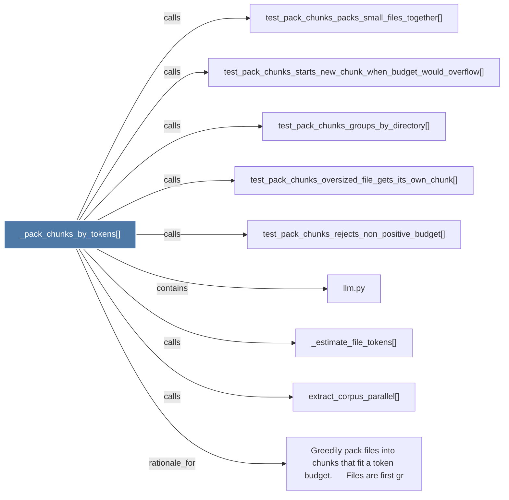

# _pack_chunks_by_tokens()

> [!info] Properties
> **File Type**: code
> **Community**: [[_COMMUNITY_Community None|Community None]]
> **Degree**: 9

## Architecture Graph


## Outbound Connections
- [[Greedily pack files into chunks that fit a token budget.      Files are first gr]] - `rationale_for` [EXTRACTED]
- [[_estimate_file_tokens()]] - `calls` [EXTRACTED]
- [[extract_corpus_parallel()]] - `calls` [EXTRACTED]
- [[llm.py]] - `contains` [EXTRACTED]
- [[test_pack_chunks_groups_by_directory()]] - `calls` [INFERRED]
- [[test_pack_chunks_oversized_file_gets_its_own_chunk()]] - `calls` [INFERRED]
- [[test_pack_chunks_packs_small_files_together()]] - `calls` [INFERRED]
- [[test_pack_chunks_rejects_non_positive_budget()]] - `calls` [INFERRED]
- [[test_pack_chunks_starts_new_chunk_when_budget_would_overflow()]] - `calls` [INFERRED]

## Inbound Dependencies
> [!abstract]- Files that link here
```dataview
LIST
FROM [[_pack_chunks_by_tokens()]]
```

#graphify/code #graphify/INFERRED #community/Community_None