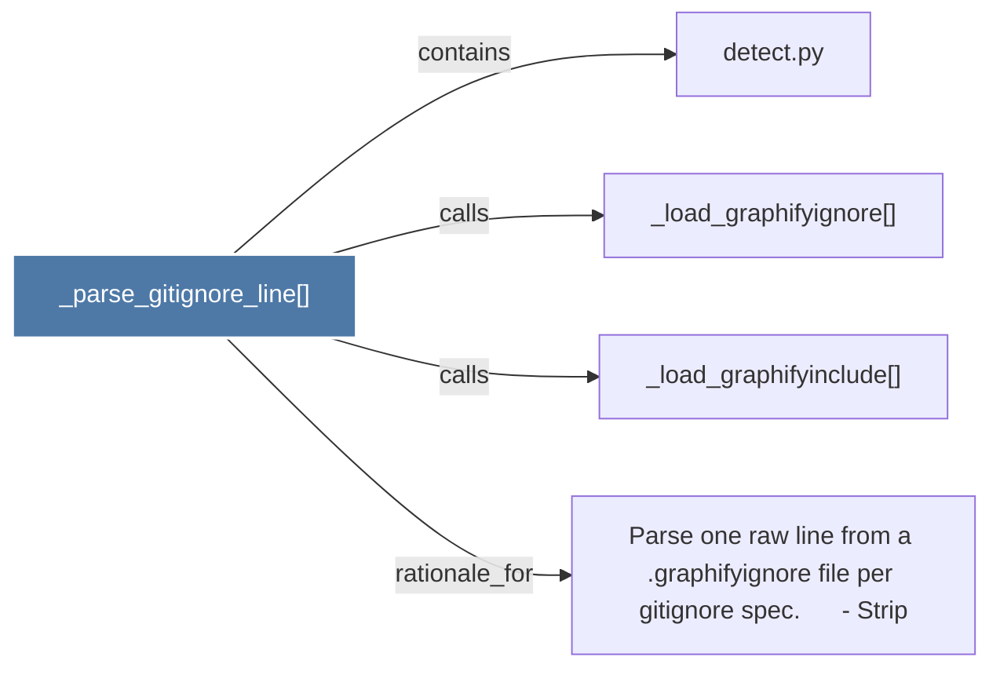

# _parse_gitignore_line()

> [!info] Properties
> **File Type**: code
> **Community**: [[_COMMUNITY_Community None|Community None]]
> **Degree**: 4

## Architecture Graph


## Outbound Connections
- [[Parse one raw line from a .graphifyignore file per gitignore spec.      - Strip]] - `rationale_for` [EXTRACTED]
- [[_load_graphifyignore()]] - `calls` [EXTRACTED]
- [[_load_graphifyinclude()]] - `calls` [EXTRACTED]
- [[detect.py]] - `contains` [EXTRACTED]

## Inbound Dependencies
> [!abstract]- Files that link here
```dataview
LIST
FROM [[_parse_gitignore_line()]]
```

#graphify/code #graphify/EXTRACTED #community/Community_None