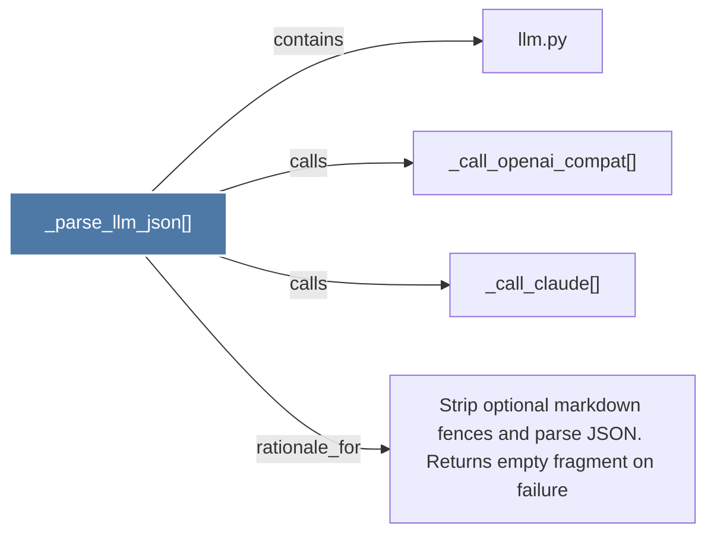

# _parse_llm_json()

> [!info] Properties
> **File Type**: code
> **Community**: [[_COMMUNITY_Community None|Community None]]
> **Degree**: 4

## Architecture Graph


## Outbound Connections
- [[Strip optional markdown fences and parse JSON. Returns empty fragment on failure]] - `rationale_for` [EXTRACTED]
- [[_call_claude()]] - `calls` [EXTRACTED]
- [[_call_openai_compat()]] - `calls` [EXTRACTED]
- [[llm.py]] - `contains` [EXTRACTED]

## Inbound Dependencies
> [!abstract]- Files that link here
```dataview
LIST
FROM [[_parse_llm_json()]]
```

#graphify/code #graphify/EXTRACTED #community/Community_None