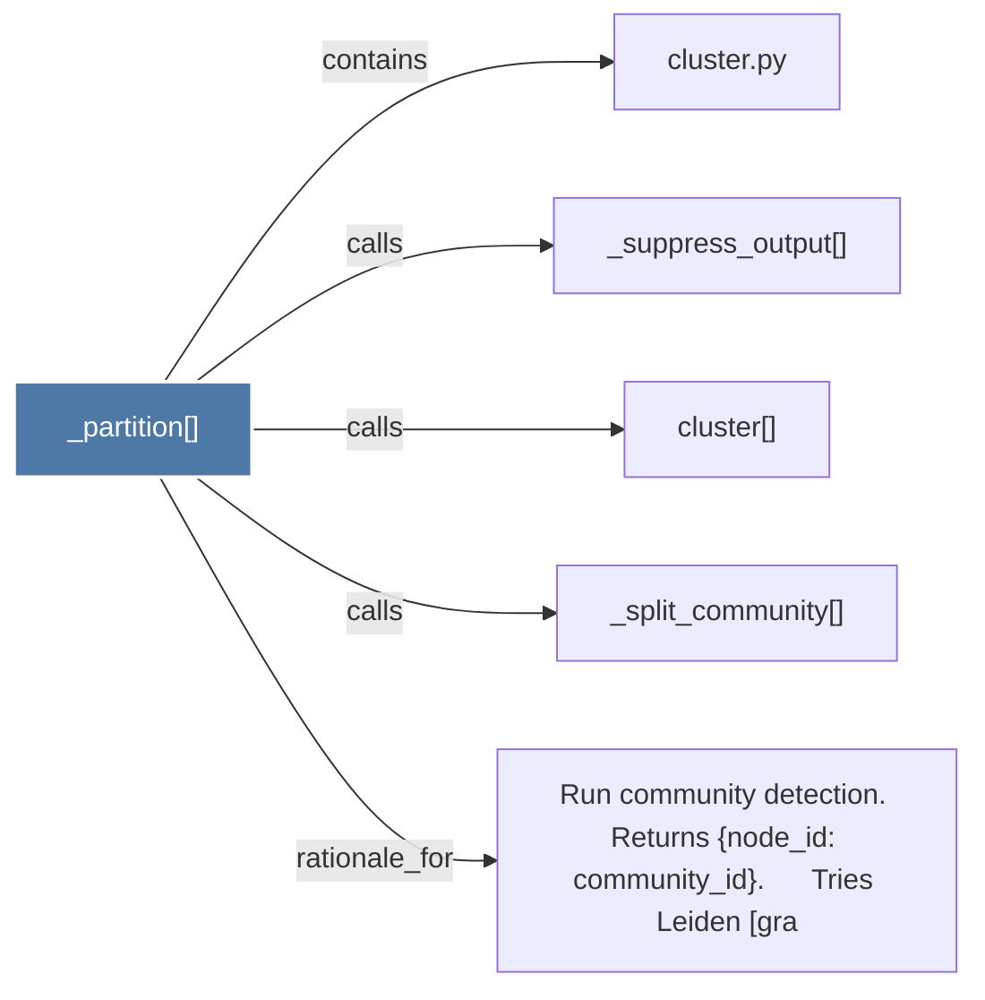

# _partition()

> [!info] Properties
> **File Type**: code
> **Community**: [[_COMMUNITY_Community None|Community None]]
> **Degree**: 5

## Architecture Graph


## Outbound Connections
- [[Run community detection. Returns {node_id community_id}.      Tries Leiden (gra]] - `rationale_for` [EXTRACTED]
- [[_split_community()]] - `calls` [EXTRACTED]
- [[_suppress_output()]] - `calls` [EXTRACTED]
- [[cluster()]] - `calls` [EXTRACTED]
- [[cluster.py]] - `contains` [EXTRACTED]

## Inbound Dependencies
> [!abstract]- Files that link here
```dataview
LIST
FROM [[_partition()]]
```

#graphify/code #graphify/EXTRACTED #community/Community_None