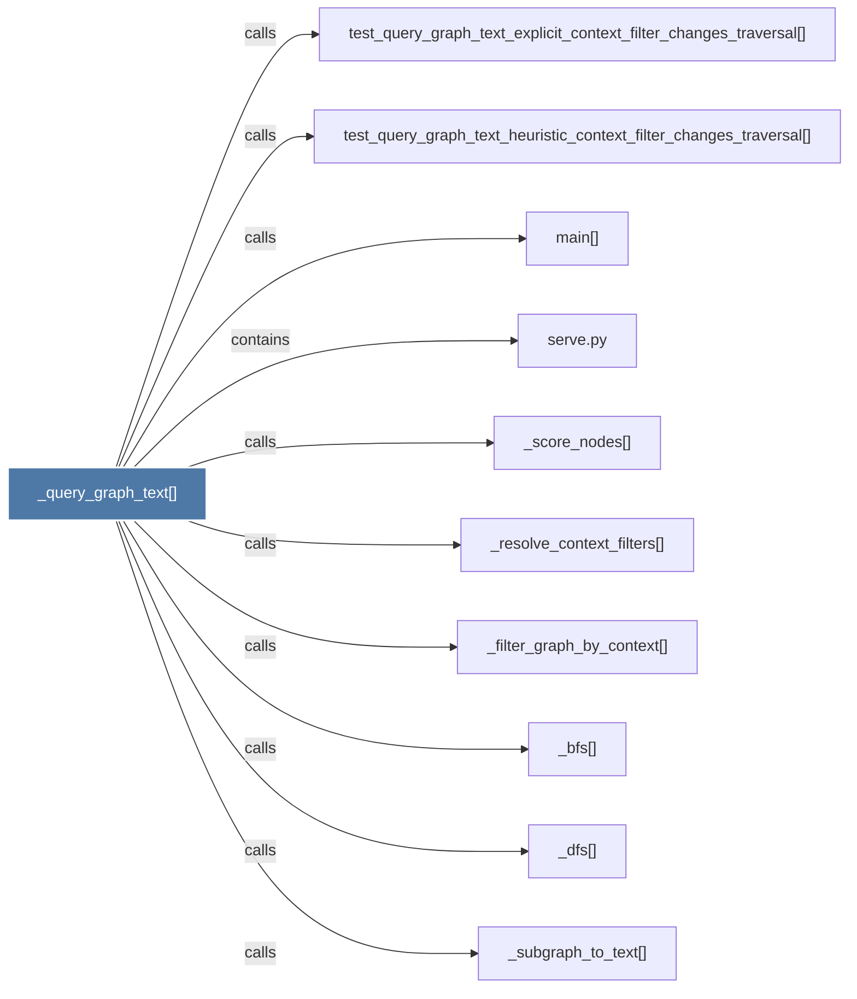

# _query_graph_text()

> [!info] Properties
> **File Type**: code
> **Community**: [[_COMMUNITY_Community None|Community None]]
> **Degree**: 10

## Architecture Graph


## Outbound Connections
- [[_bfs()]] - `calls` [EXTRACTED]
- [[_dfs()]] - `calls` [EXTRACTED]
- [[_filter_graph_by_context()]] - `calls` [EXTRACTED]
- [[_resolve_context_filters()]] - `calls` [EXTRACTED]
- [[_score_nodes()]] - `calls` [EXTRACTED]
- [[_subgraph_to_text()]] - `calls` [EXTRACTED]
- [[main()_2]] - `calls` [INFERRED]
- [[serve.py]] - `contains` [EXTRACTED]
- [[test_query_graph_text_explicit_context_filter_changes_traversal()]] - `calls` [INFERRED]
- [[test_query_graph_text_heuristic_context_filter_changes_traversal()]] - `calls` [INFERRED]

## Inbound Dependencies
> [!abstract]- Files that link here
```dataview
LIST
FROM [[_query_graph_text()]]
```

#graphify/code #graphify/EXTRACTED #community/Community_None