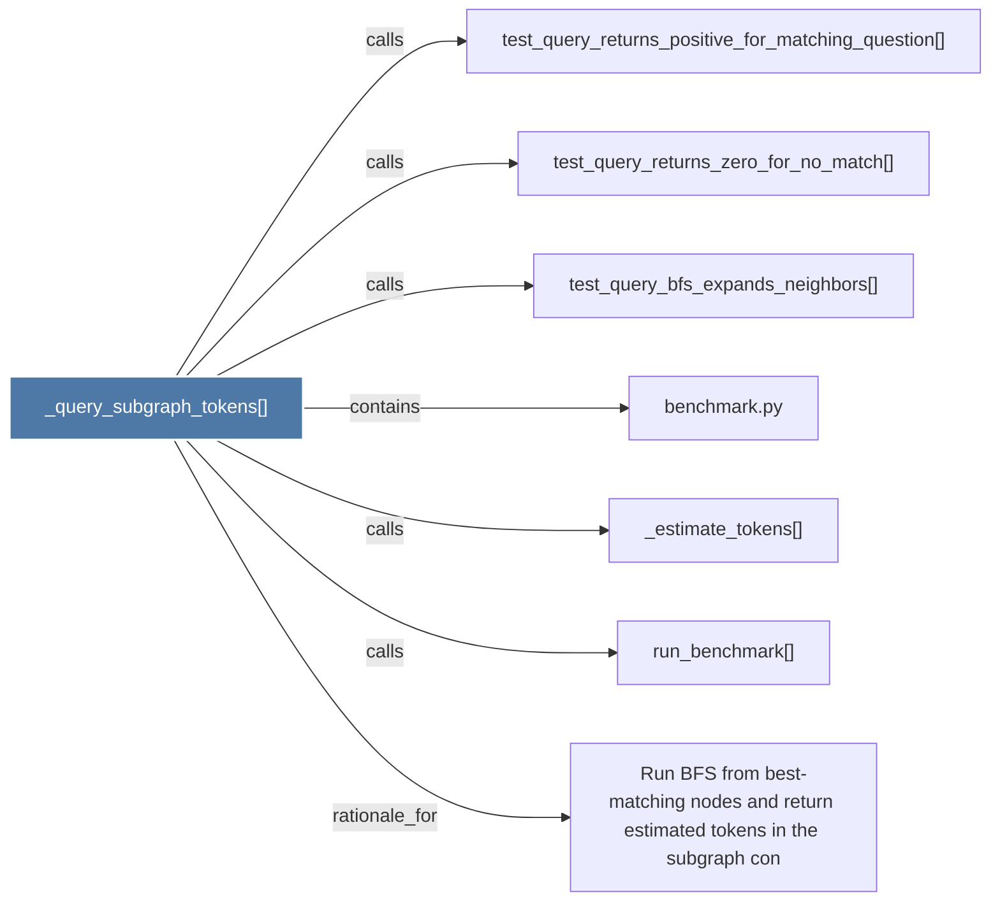

# _query_subgraph_tokens()

> [!info] Properties
> **File Type**: code
> **Community**: [[_COMMUNITY_Community None|Community None]]
> **Degree**: 7

## Architecture Graph


## Outbound Connections
- [[Run BFS from best-matching nodes and return estimated tokens in the subgraph con]] - `rationale_for` [EXTRACTED]
- [[_estimate_tokens()]] - `calls` [EXTRACTED]
- [[benchmark.py]] - `contains` [EXTRACTED]
- [[run_benchmark()]] - `calls` [EXTRACTED]
- [[test_query_bfs_expands_neighbors()]] - `calls` [INFERRED]
- [[test_query_returns_positive_for_matching_question()]] - `calls` [INFERRED]
- [[test_query_returns_zero_for_no_match()]] - `calls` [INFERRED]

## Inbound Dependencies
> [!abstract]- Files that link here
```dataview
LIST
FROM [[_query_subgraph_tokens()]]
```

#graphify/code #graphify/EXTRACTED #community/Community_None