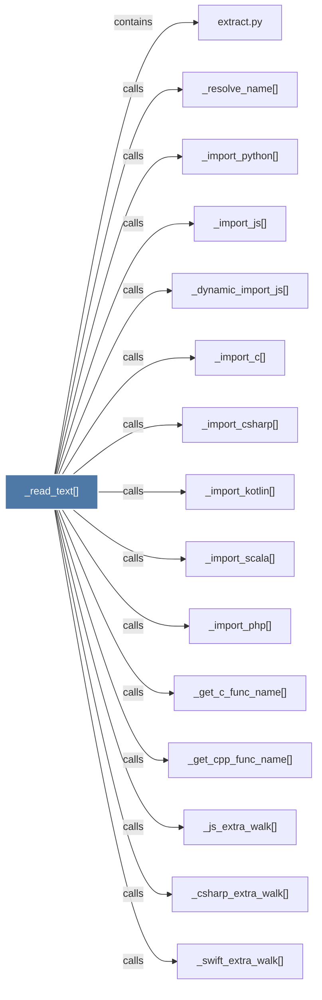

# _read_text()

> [!info] Properties
> **File Type**: code
> **Community**: [[_COMMUNITY_Community None|Community None]]
> **Degree**: 18

## Architecture Graph


## Outbound Connections
- [[_csharp_extra_walk()]] - `calls` [EXTRACTED]
- [[_dynamic_import_js()]] - `calls` [EXTRACTED]
- [[_get_c_func_name()]] - `calls` [EXTRACTED]
- [[_get_cpp_func_name()]] - `calls` [EXTRACTED]
- [[_import_c()]] - `calls` [EXTRACTED]
- [[_import_csharp()]] - `calls` [EXTRACTED]
- [[_import_js()]] - `calls` [EXTRACTED]
- [[_import_kotlin()]] - `calls` [EXTRACTED]
- [[_import_lua()]] - `calls` [EXTRACTED]
- [[_import_php()]] - `calls` [EXTRACTED]
- [[_import_python()]] - `calls` [EXTRACTED]
- [[_import_scala()]] - `calls` [EXTRACTED]
- [[_import_swift()]] - `calls` [EXTRACTED]
- [[_js_extra_walk()]] - `calls` [EXTRACTED]
- [[_read_csharp_type_name()]] - `calls` [EXTRACTED]
- [[_resolve_name()]] - `calls` [EXTRACTED]
- [[_swift_extra_walk()]] - `calls` [EXTRACTED]
- [[extract.py]] - `contains` [EXTRACTED]

## Inbound Dependencies
> [!abstract]- Files that link here
```dataview
LIST
FROM [[_read_text()]]
```

#graphify/code #graphify/EXTRACTED #community/Community_None