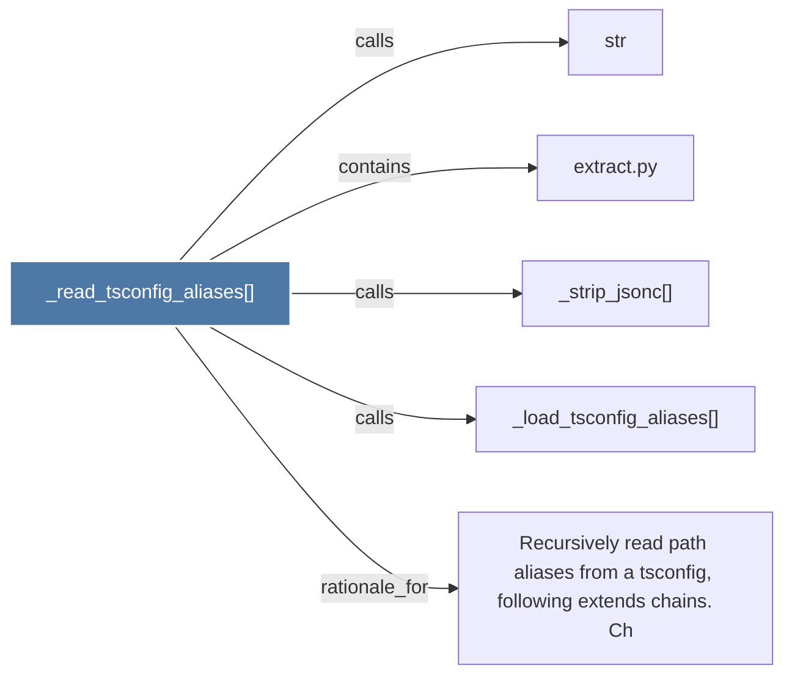

# _read_tsconfig_aliases()

> [!info] Properties
> **File Type**: code
> **Community**: [[_COMMUNITY_Community None|Community None]]
> **Degree**: 5

## Architecture Graph


## Outbound Connections
- [[Recursively read path aliases from a tsconfig, following extends chains.      Ch]] - `rationale_for` [EXTRACTED]
- [[_load_tsconfig_aliases()]] - `calls` [EXTRACTED]
- [[_strip_jsonc()]] - `calls` [EXTRACTED]
- [[extract.py]] - `contains` [EXTRACTED]
- [[str]] - `calls` [INFERRED]

## Inbound Dependencies
> [!abstract]- Files that link here
```dataview
LIST
FROM [[_read_tsconfig_aliases()]]
```

#graphify/code #graphify/EXTRACTED #community/Community_None