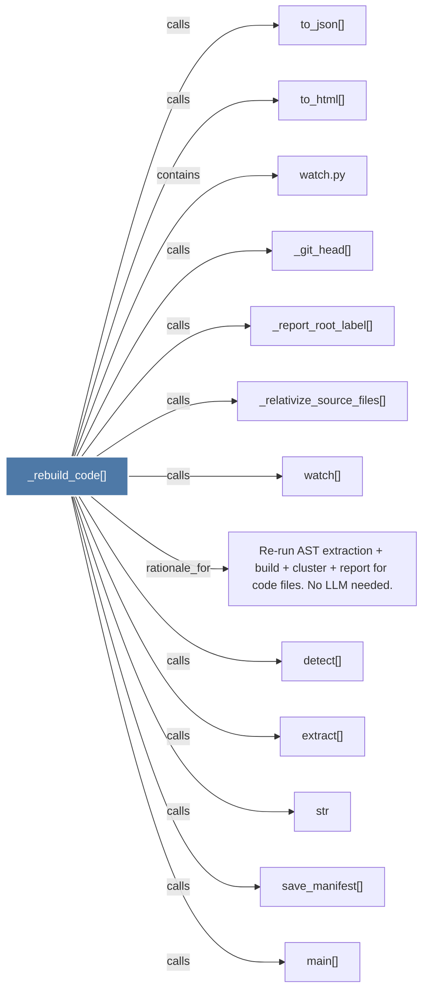

# _rebuild_code()

> [!info] Properties
> **File Type**: code
> **Community**: [[_COMMUNITY_Community None|Community None]]
> **Degree**: 13

## Architecture Graph


## Outbound Connections
- [[Re-run AST extraction + build + cluster + report for code files. No LLM needed.]] - `rationale_for` [EXTRACTED]
- [[_git_head()_1]] - `calls` [EXTRACTED]
- [[_relativize_source_files()]] - `calls` [EXTRACTED]
- [[_report_root_label()]] - `calls` [EXTRACTED]
- [[detect()]] - `calls` [INFERRED]
- [[extract()]] - `calls` [INFERRED]
- [[main()_2]] - `calls` [INFERRED]
- [[save_manifest()]] - `calls` [INFERRED]
- [[str]] - `calls` [INFERRED]
- [[to_html()]] - `calls` [INFERRED]
- [[to_json()]] - `calls` [INFERRED]
- [[watch()]] - `calls` [EXTRACTED]
- [[watch.py]] - `contains` [EXTRACTED]

## Inbound Dependencies
> [!abstract]- Files that link here
```dataview
LIST
FROM [[_rebuild_code()]]
```

#graphify/code #graphify/INFERRED #community/Community_None