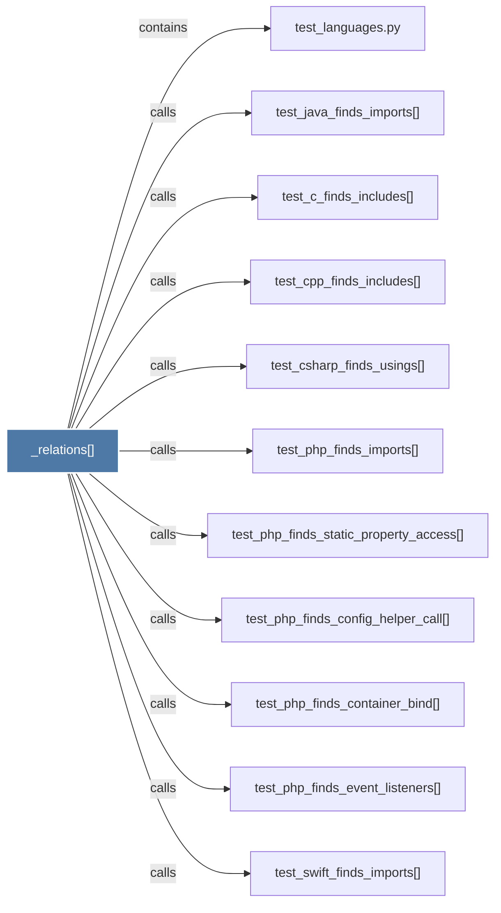

# _relations()

> [!info] Properties
> **File Type**: code
> **Community**: [[_COMMUNITY_Community None|Community None]]
> **Degree**: 11

## Architecture Graph


## Outbound Connections
- [[test_c_finds_includes()]] - `calls` [EXTRACTED]
- [[test_cpp_finds_includes()]] - `calls` [EXTRACTED]
- [[test_csharp_finds_usings()]] - `calls` [EXTRACTED]
- [[test_java_finds_imports()]] - `calls` [EXTRACTED]
- [[test_languages.py]] - `contains` [EXTRACTED]
- [[test_php_finds_config_helper_call()]] - `calls` [EXTRACTED]
- [[test_php_finds_container_bind()]] - `calls` [EXTRACTED]
- [[test_php_finds_event_listeners()]] - `calls` [EXTRACTED]
- [[test_php_finds_imports()]] - `calls` [EXTRACTED]
- [[test_php_finds_static_property_access()]] - `calls` [EXTRACTED]
- [[test_swift_finds_imports()]] - `calls` [EXTRACTED]

## Inbound Dependencies
> [!abstract]- Files that link here
```dataview
LIST
FROM [[_relations()]]
```

#graphify/code #graphify/EXTRACTED #community/Community_None