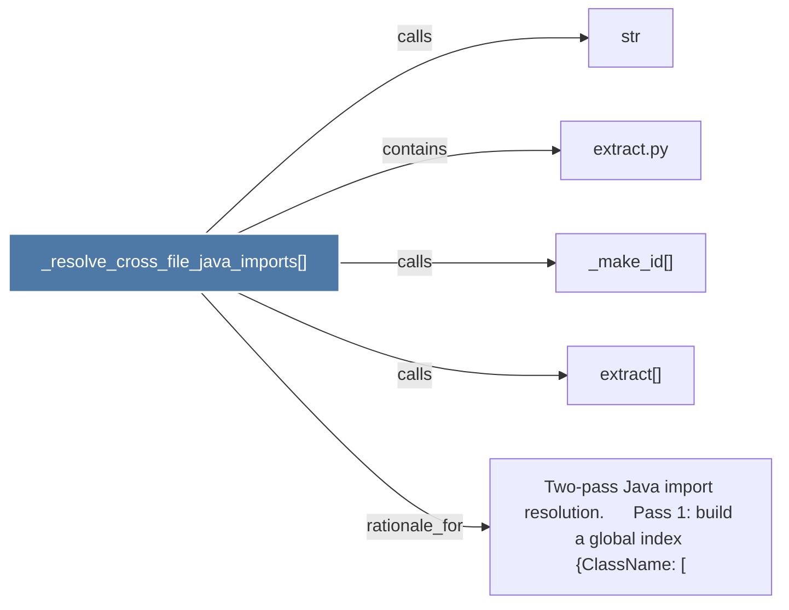

# _resolve_cross_file_java_imports()

> [!info] Properties
> **File Type**: code
> **Community**: [[_COMMUNITY_Community None|Community None]]
> **Degree**: 5

## Architecture Graph


## Outbound Connections
- [[Two-pass Java import resolution.      Pass 1 build a global index {ClassName]] - `rationale_for` [EXTRACTED]
- [[_make_id()]] - `calls` [EXTRACTED]
- [[extract()]] - `calls` [EXTRACTED]
- [[extract.py]] - `contains` [EXTRACTED]
- [[str]] - `calls` [INFERRED]

## Inbound Dependencies
> [!abstract]- Files that link here
```dataview
LIST
FROM [[_resolve_cross_file_java_imports()]]
```

#graphify/code #graphify/EXTRACTED #community/Community_None