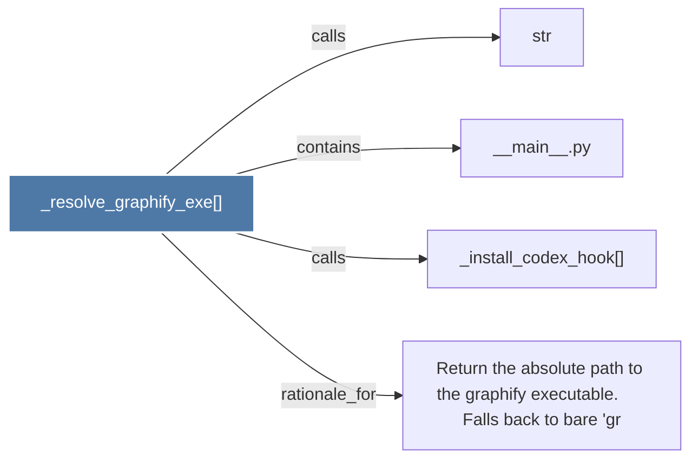

# _resolve_graphify_exe()

> [!info] Properties
> **File Type**: code
> **Community**: [[_COMMUNITY_Community None|Community None]]
> **Degree**: 4

## Architecture Graph


## Outbound Connections
- [[Return the absolute path to the graphify executable.      Falls back to bare 'gr]] - `rationale_for` [EXTRACTED]
- [[__main__.py]] - `contains` [EXTRACTED]
- [[_install_codex_hook()]] - `calls` [EXTRACTED]
- [[str]] - `calls` [INFERRED]

## Inbound Dependencies
> [!abstract]- Files that link here
```dataview
LIST
FROM [[_resolve_graphify_exe()]]
```

#graphify/code #graphify/EXTRACTED #community/Community_None