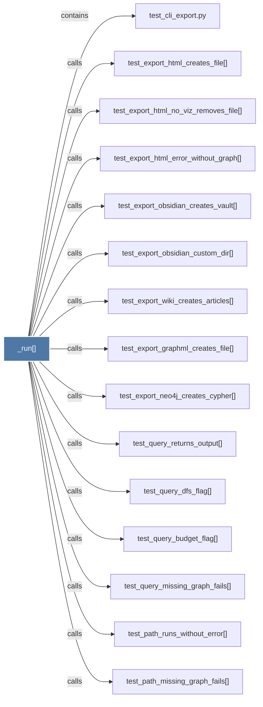

# _run()

> [!info] Properties
> **File Type**: code
> **Community**: [[_COMMUNITY_Community None|Community None]]
> **Degree**: 18

## Architecture Graph


## Outbound Connections
- [[test_cli_export.py]] - `contains` [EXTRACTED]
- [[test_explain_missing_graph_fails()]] - `calls` [EXTRACTED]
- [[test_explain_runs_without_error()]] - `calls` [EXTRACTED]
- [[test_export_graphml_creates_file()]] - `calls` [EXTRACTED]
- [[test_export_html_creates_file()]] - `calls` [EXTRACTED]
- [[test_export_html_error_without_graph()]] - `calls` [EXTRACTED]
- [[test_export_html_no_viz_removes_file()]] - `calls` [EXTRACTED]
- [[test_export_neo4j_creates_cypher()]] - `calls` [EXTRACTED]
- [[test_export_obsidian_creates_vault()]] - `calls` [EXTRACTED]
- [[test_export_obsidian_custom_dir()]] - `calls` [EXTRACTED]
- [[test_export_unknown_format_fails()]] - `calls` [EXTRACTED]
- [[test_export_wiki_creates_articles()]] - `calls` [EXTRACTED]
- [[test_path_missing_graph_fails()]] - `calls` [EXTRACTED]
- [[test_path_runs_without_error()]] - `calls` [EXTRACTED]
- [[test_query_budget_flag()]] - `calls` [EXTRACTED]
- [[test_query_dfs_flag()]] - `calls` [EXTRACTED]
- [[test_query_missing_graph_fails()]] - `calls` [EXTRACTED]
- [[test_query_returns_output()]] - `calls` [EXTRACTED]

## Inbound Dependencies
> [!abstract]- Files that link here
```dataview
LIST
FROM [[_run()]]
```

#graphify/code #graphify/EXTRACTED #community/Community_None