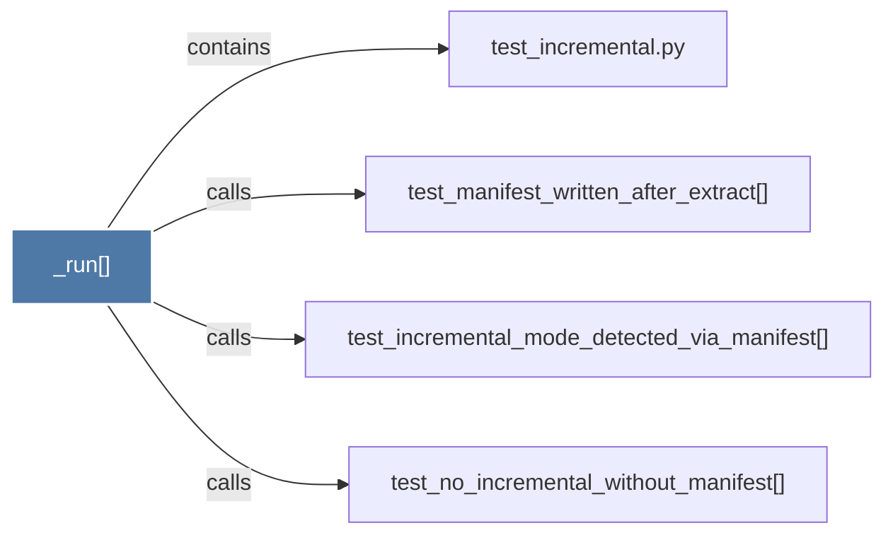

# _run()

> [!info] Properties
> **File Type**: code
> **Community**: [[_COMMUNITY_Community None|Community None]]
> **Degree**: 4

## Architecture Graph


## Outbound Connections
- [[test_incremental.py]] - `contains` [EXTRACTED]
- [[test_incremental_mode_detected_via_manifest()]] - `calls` [EXTRACTED]
- [[test_manifest_written_after_extract()]] - `calls` [EXTRACTED]
- [[test_no_incremental_without_manifest()]] - `calls` [EXTRACTED]

## Inbound Dependencies
> [!abstract]- Files that link here
```dataview
LIST
FROM [[_run()_1]]
```

#graphify/code #graphify/EXTRACTED #community/Community_None