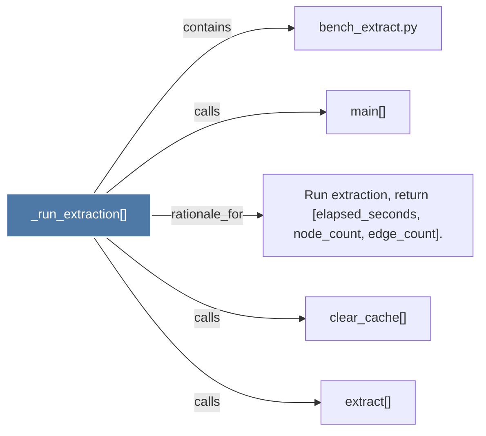

# _run_extraction()

> [!info] Properties
> **File Type**: code
> **Community**: [[_COMMUNITY_Community None|Community None]]
> **Degree**: 5

## Architecture Graph


## Outbound Connections
- [[Run extraction, return (elapsed_seconds, node_count, edge_count).]] - `rationale_for` [EXTRACTED]
- [[bench_extract.py]] - `contains` [EXTRACTED]
- [[clear_cache()]] - `calls` [INFERRED]
- [[extract()]] - `calls` [INFERRED]
- [[main()]] - `calls` [EXTRACTED]

## Inbound Dependencies
> [!abstract]- Files that link here
```dataview
LIST
FROM [[_run_extraction()]]
```

#graphify/code #graphify/EXTRACTED #community/Community_None