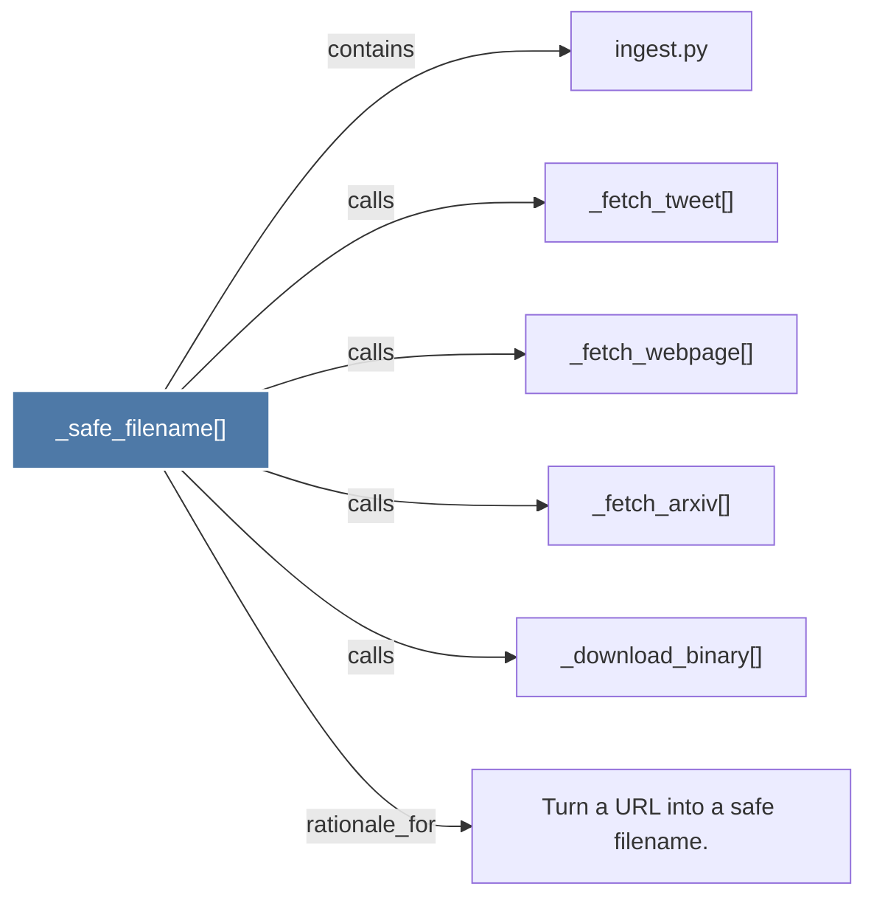

# _safe_filename()

> [!info] Properties
> **File Type**: code
> **Community**: [[_COMMUNITY_Community None|Community None]]
> **Degree**: 6

## Architecture Graph


## Outbound Connections
- [[Turn a URL into a safe filename.]] - `rationale_for` [EXTRACTED]
- [[_download_binary()]] - `calls` [EXTRACTED]
- [[_fetch_arxiv()]] - `calls` [EXTRACTED]
- [[_fetch_tweet()]] - `calls` [EXTRACTED]
- [[_fetch_webpage()]] - `calls` [EXTRACTED]
- [[ingest.py]] - `contains` [EXTRACTED]

## Inbound Dependencies
> [!abstract]- Files that link here
```dataview
LIST
FROM [[_safe_filename()_1]]
```

#graphify/code #graphify/EXTRACTED #community/Community_None