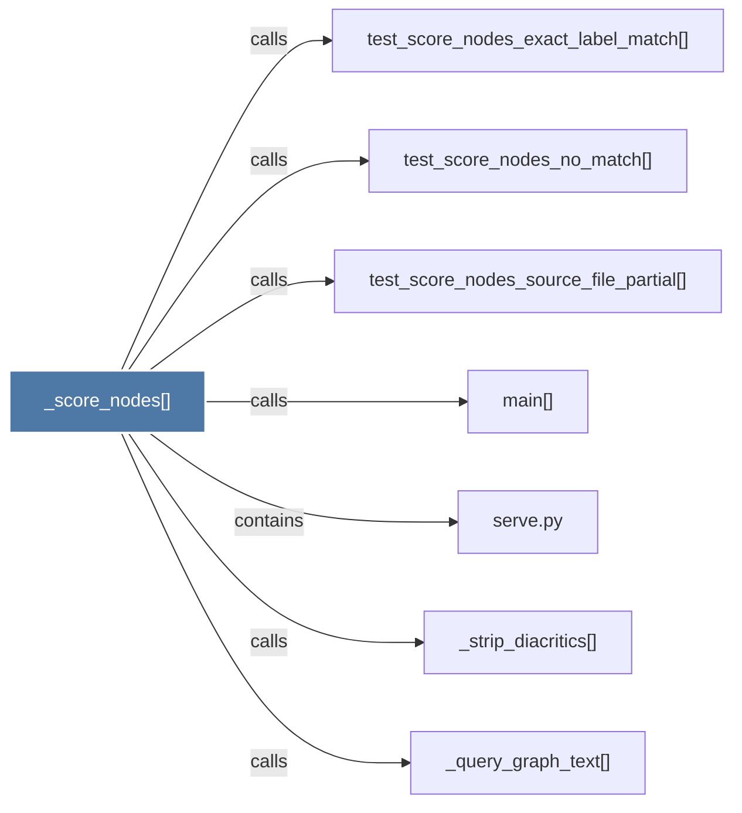

# _score_nodes()

> [!info] Properties
> **File Type**: code
> **Community**: [[_COMMUNITY_Community None|Community None]]
> **Degree**: 7

## Architecture Graph


## Outbound Connections
- [[_query_graph_text()]] - `calls` [EXTRACTED]
- [[_strip_diacritics()_1]] - `calls` [EXTRACTED]
- [[main()_2]] - `calls` [INFERRED]
- [[serve.py]] - `contains` [EXTRACTED]
- [[test_score_nodes_exact_label_match()]] - `calls` [INFERRED]
- [[test_score_nodes_no_match()]] - `calls` [INFERRED]
- [[test_score_nodes_source_file_partial()]] - `calls` [INFERRED]

## Inbound Dependencies
> [!abstract]- Files that link here
```dataview
LIST
FROM [[_score_nodes()]]
```

#graphify/code #graphify/INFERRED #community/Community_None