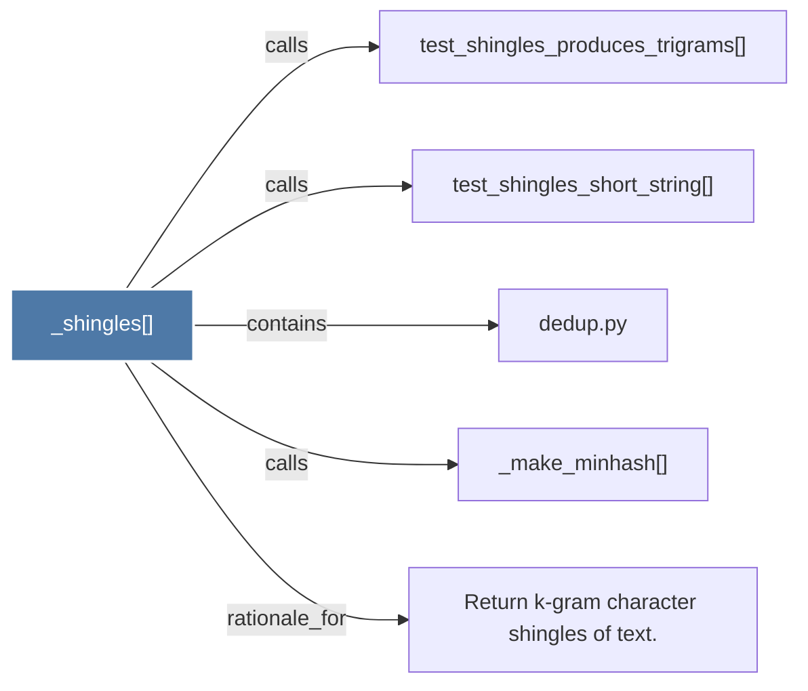

# _shingles()

> [!info] Properties
> **File Type**: code
> **Community**: [[_COMMUNITY_Community None|Community None]]
> **Degree**: 5

## Architecture Graph


## Outbound Connections
- [[Return k-gram character shingles of text.]] - `rationale_for` [EXTRACTED]
- [[_make_minhash()]] - `calls` [EXTRACTED]
- [[dedup.py]] - `contains` [EXTRACTED]
- [[test_shingles_produces_trigrams()]] - `calls` [INFERRED]
- [[test_shingles_short_string()]] - `calls` [INFERRED]

## Inbound Dependencies
> [!abstract]- Files that link here
```dataview
LIST
FROM [[_shingles()]]
```

#graphify/code #graphify/EXTRACTED #community/Community_None