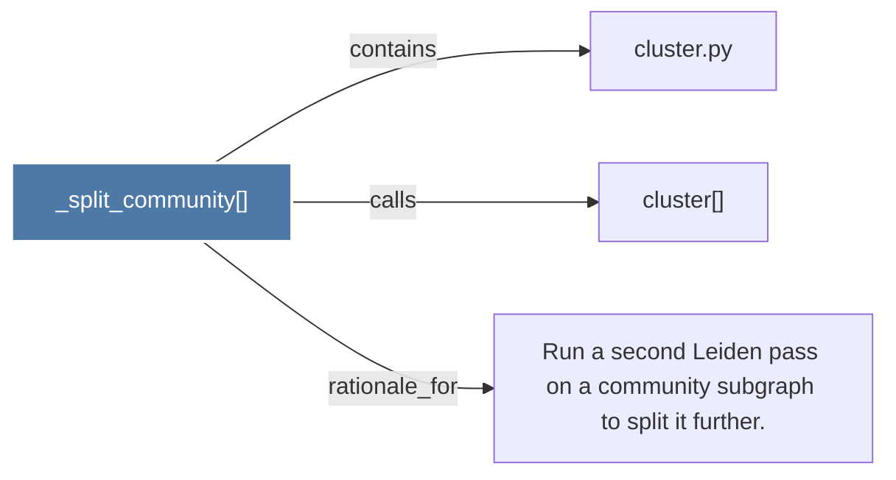

# _split_community()

> [!info] Properties
> **File Type**: code
> **Community**: [[_COMMUNITY_Community None|Community None]]
> **Degree**: 3

## Architecture Graph


## Outbound Connections
- [[Run a second Leiden pass on a community subgraph to split it further._1]] - `rationale_for` [EXTRACTED]
- [[cluster()_1]] - `calls` [EXTRACTED]
- [[cluster.py_1]] - `contains` [EXTRACTED]

## Inbound Dependencies
> [!abstract]- Files that link here
```dataview
LIST
FROM [[_split_community()_1]]
```

#graphify/code #graphify/EXTRACTED #community/Community_None