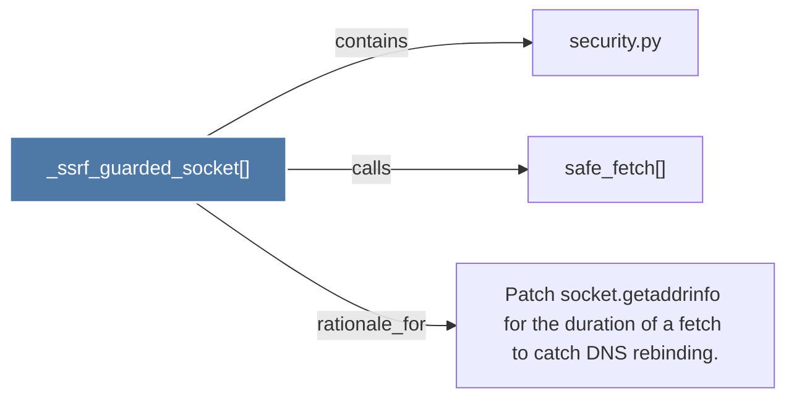

# _ssrf_guarded_socket()

> [!info] Properties
> **File Type**: code
> **Community**: [[_COMMUNITY_Community None|Community None]]
> **Degree**: 3

## Architecture Graph


## Outbound Connections
- [[Patch socket.getaddrinfo for the duration of a fetch to catch DNS rebinding.]] - `rationale_for` [EXTRACTED]
- [[safe_fetch()]] - `calls` [EXTRACTED]
- [[security.py]] - `contains` [EXTRACTED]

## Inbound Dependencies
> [!abstract]- Files that link here
```dataview
LIST
FROM [[_ssrf_guarded_socket()]]
```

#graphify/code #graphify/EXTRACTED #community/Community_None