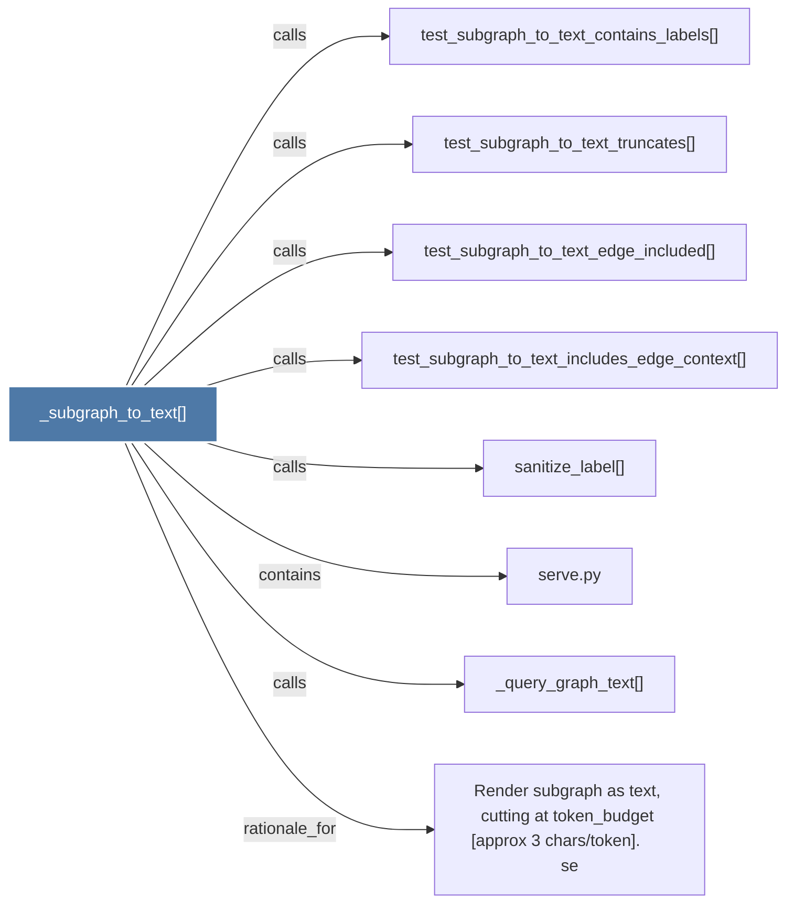

# _subgraph_to_text()

> [!info] Properties
> **File Type**: code
> **Community**: [[_COMMUNITY_Community None|Community None]]
> **Degree**: 8

## Architecture Graph


## Outbound Connections
- [[Render subgraph as text, cutting at token_budget (approx 3 charstoken).      se]] - `rationale_for` [EXTRACTED]
- [[_query_graph_text()]] - `calls` [EXTRACTED]
- [[sanitize_label()]] - `calls` [INFERRED]
- [[serve.py]] - `contains` [EXTRACTED]
- [[test_subgraph_to_text_contains_labels()]] - `calls` [INFERRED]
- [[test_subgraph_to_text_edge_included()]] - `calls` [INFERRED]
- [[test_subgraph_to_text_includes_edge_context()]] - `calls` [INFERRED]
- [[test_subgraph_to_text_truncates()]] - `calls` [INFERRED]

## Inbound Dependencies
> [!abstract]- Files that link here
```dataview
LIST
FROM [[_subgraph_to_text()]]
```

#graphify/code #graphify/INFERRED #community/Community_None