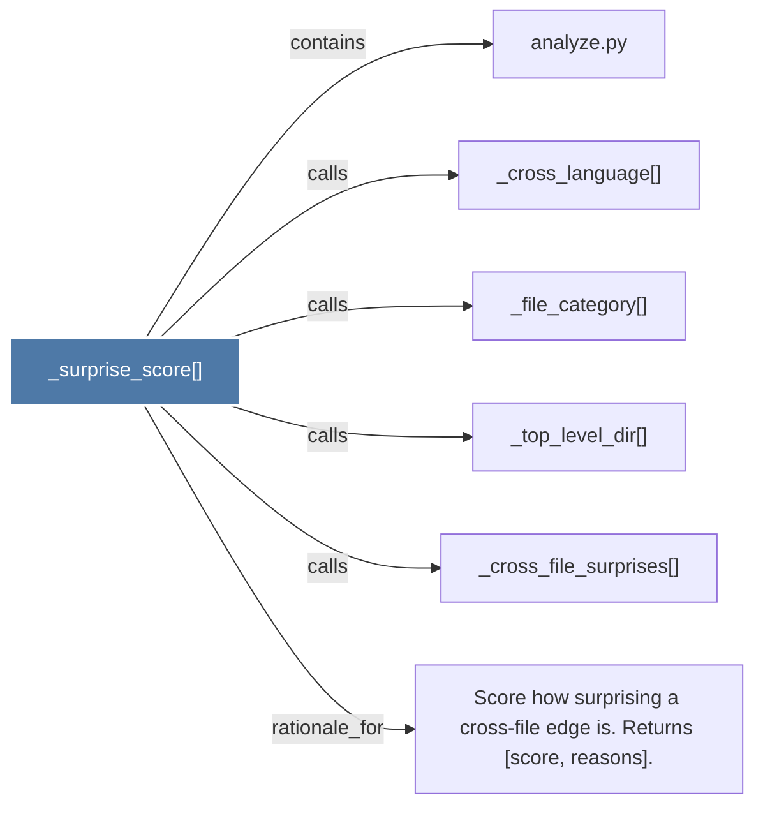

# _surprise_score()

> [!info] Properties
> **File Type**: code
> **Community**: [[_COMMUNITY_Community None|Community None]]
> **Degree**: 6

## Architecture Graph


## Outbound Connections
- [[Score how surprising a cross-file edge is. Returns (score, reasons).]] - `rationale_for` [EXTRACTED]
- [[_cross_file_surprises()]] - `calls` [EXTRACTED]
- [[_cross_language()]] - `calls` [EXTRACTED]
- [[_file_category()]] - `calls` [EXTRACTED]
- [[_top_level_dir()]] - `calls` [EXTRACTED]
- [[analyze.py]] - `contains` [EXTRACTED]

## Inbound Dependencies
> [!abstract]- Files that link here
```dataview
LIST
FROM [[_surprise_score()]]
```

#graphify/code #graphify/EXTRACTED #community/Community_None