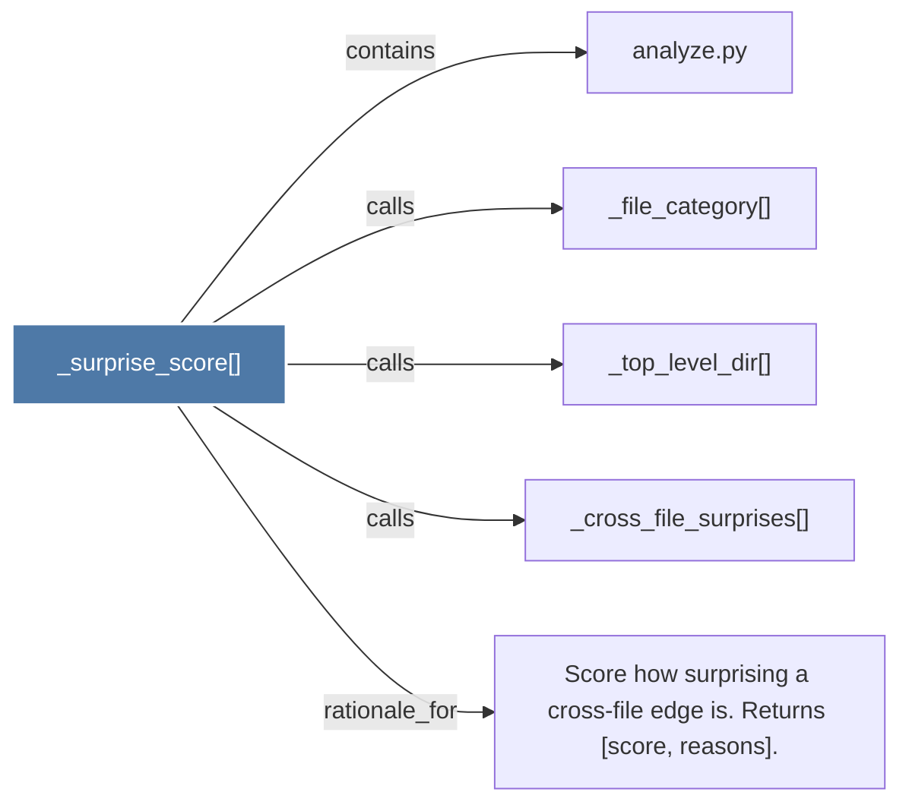

# _surprise_score()

> [!info] Properties
> **File Type**: code
> **Community**: [[_COMMUNITY_Community None|Community None]]
> **Degree**: 5

## Architecture Graph


## Outbound Connections
- [[Score how surprising a cross-file edge is. Returns (score, reasons)._1]] - `rationale_for` [EXTRACTED]
- [[_cross_file_surprises()_1]] - `calls` [EXTRACTED]
- [[_file_category()_1]] - `calls` [EXTRACTED]
- [[_top_level_dir()_1]] - `calls` [EXTRACTED]
- [[analyze.py_1]] - `contains` [EXTRACTED]

## Inbound Dependencies
> [!abstract]- Files that link here
```dataview
LIST
FROM [[_surprise_score()_1]]
```

#graphify/code #graphify/EXTRACTED #community/Community_None