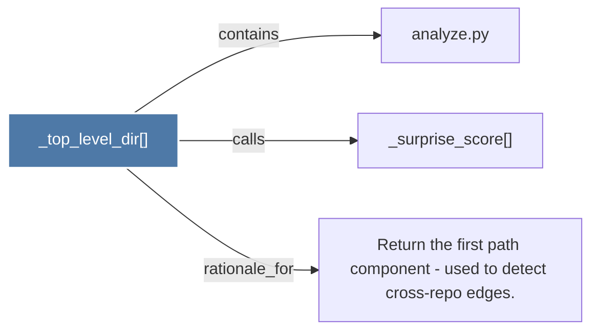

# _top_level_dir()

> [!info] Properties
> **File Type**: code
> **Community**: [[_COMMUNITY_Community None|Community None]]
> **Degree**: 3

## Architecture Graph


## Outbound Connections
- [[Return the first path component - used to detect cross-repo edges.]] - `rationale_for` [EXTRACTED]
- [[_surprise_score()]] - `calls` [EXTRACTED]
- [[analyze.py]] - `contains` [EXTRACTED]

## Inbound Dependencies
> [!abstract]- Files that link here
```dataview
LIST
FROM [[_top_level_dir()]]
```

#graphify/code #graphify/EXTRACTED #community/Community_None