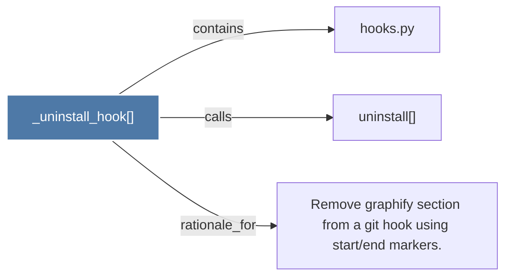

# _uninstall_hook()

> [!info] Properties
> **File Type**: code
> **Community**: [[_COMMUNITY_Community None|Community None]]
> **Degree**: 3

## Architecture Graph


## Outbound Connections
- [[Remove graphify section from a git hook using startend markers.]] - `rationale_for` [EXTRACTED]
- [[hooks.py]] - `contains` [EXTRACTED]
- [[uninstall()]] - `calls` [EXTRACTED]

## Inbound Dependencies
> [!abstract]- Files that link here
```dataview
LIST
FROM [[_uninstall_hook()]]
```

#graphify/code #graphify/EXTRACTED #community/Community_None