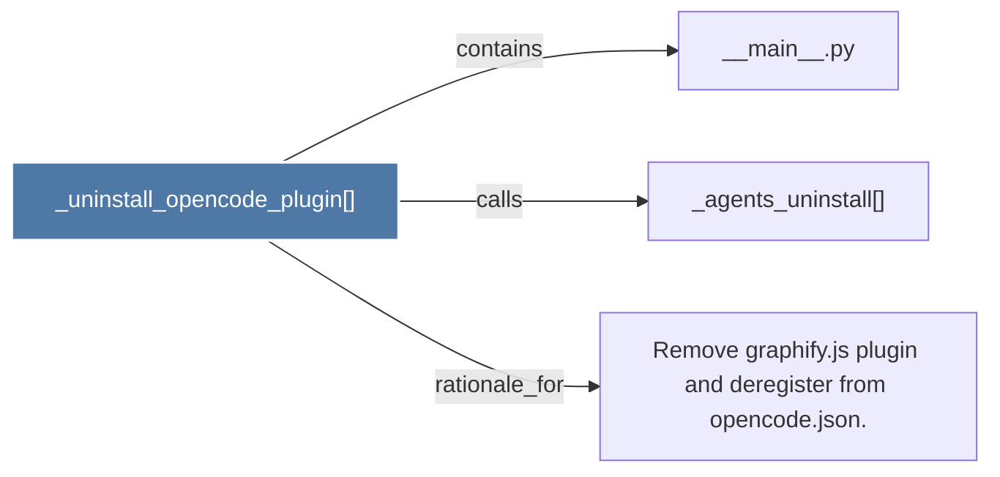

# _uninstall_opencode_plugin()

> [!info] Properties
> **File Type**: code
> **Community**: [[_COMMUNITY_Community None|Community None]]
> **Degree**: 3

## Architecture Graph


## Outbound Connections
- [[Remove graphify.js plugin and deregister from opencode.json.]] - `rationale_for` [EXTRACTED]
- [[__main__.py]] - `contains` [EXTRACTED]
- [[_agents_uninstall()_1]] - `calls` [EXTRACTED]

## Inbound Dependencies
> [!abstract]- Files that link here
```dataview
LIST
FROM [[_uninstall_opencode_plugin()]]
```

#graphify/code #graphify/EXTRACTED #community/Community_None