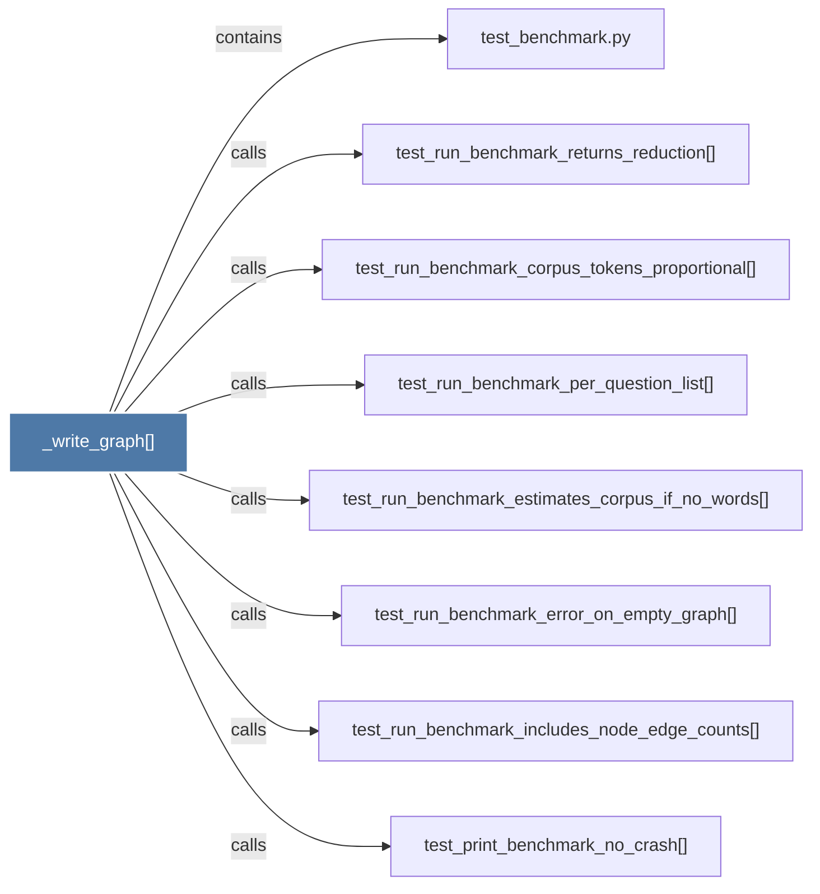

# _write_graph()

> [!info] Properties
> **File Type**: code
> **Community**: [[_COMMUNITY_Community None|Community None]]
> **Degree**: 8

## Architecture Graph


## Outbound Connections
- [[test_benchmark.py]] - `contains` [EXTRACTED]
- [[test_print_benchmark_no_crash()]] - `calls` [EXTRACTED]
- [[test_run_benchmark_corpus_tokens_proportional()]] - `calls` [EXTRACTED]
- [[test_run_benchmark_error_on_empty_graph()]] - `calls` [EXTRACTED]
- [[test_run_benchmark_estimates_corpus_if_no_words()]] - `calls` [EXTRACTED]
- [[test_run_benchmark_includes_node_edge_counts()]] - `calls` [EXTRACTED]
- [[test_run_benchmark_per_question_list()]] - `calls` [EXTRACTED]
- [[test_run_benchmark_returns_reduction()]] - `calls` [EXTRACTED]

## Inbound Dependencies
> [!abstract]- Files that link here
```dataview
LIST
FROM [[_write_graph()]]
```

#graphify/code #graphify/EXTRACTED #community/Community_None