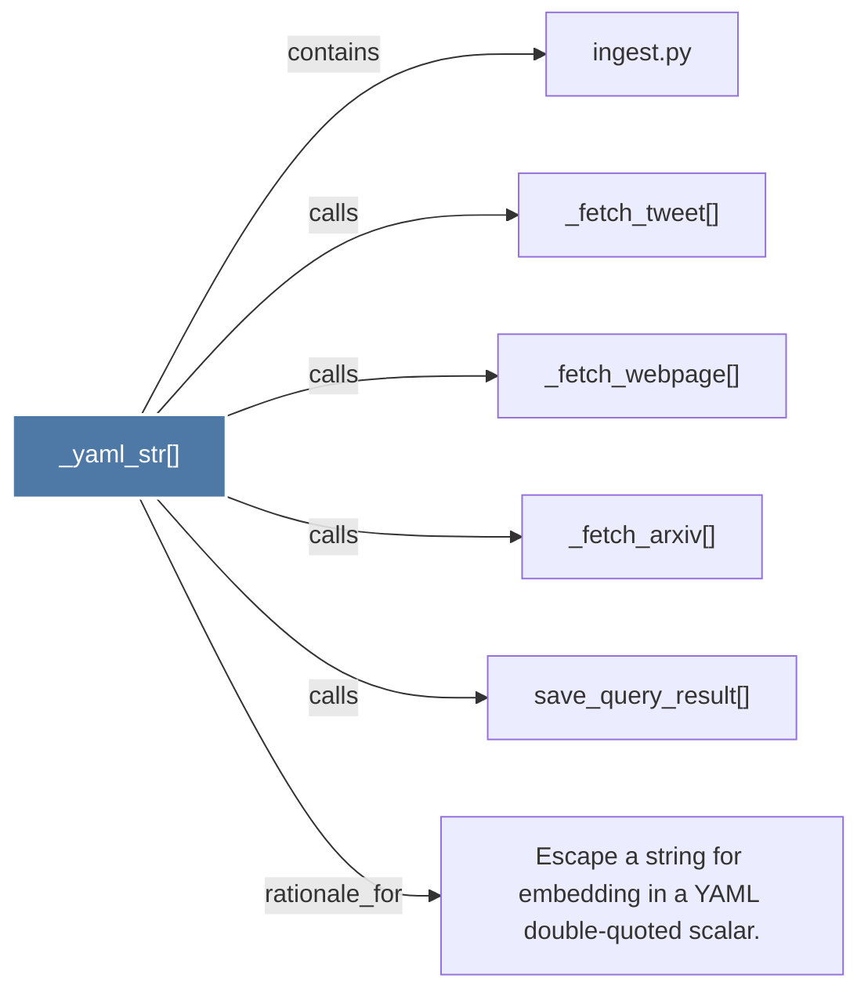

# _yaml_str()

> [!info] Properties
> **File Type**: code
> **Community**: [[_COMMUNITY_Community None|Community None]]
> **Degree**: 6

## Architecture Graph


## Outbound Connections
- [[Escape a string for embedding in a YAML double-quoted scalar.]] - `rationale_for` [EXTRACTED]
- [[_fetch_arxiv()]] - `calls` [EXTRACTED]
- [[_fetch_tweet()]] - `calls` [EXTRACTED]
- [[_fetch_webpage()]] - `calls` [EXTRACTED]
- [[ingest.py]] - `contains` [EXTRACTED]
- [[save_query_result()]] - `calls` [EXTRACTED]

## Inbound Dependencies
> [!abstract]- Files that link here
```dataview
LIST
FROM [[_yaml_str()]]
```

#graphify/code #graphify/EXTRACTED #community/Community_None