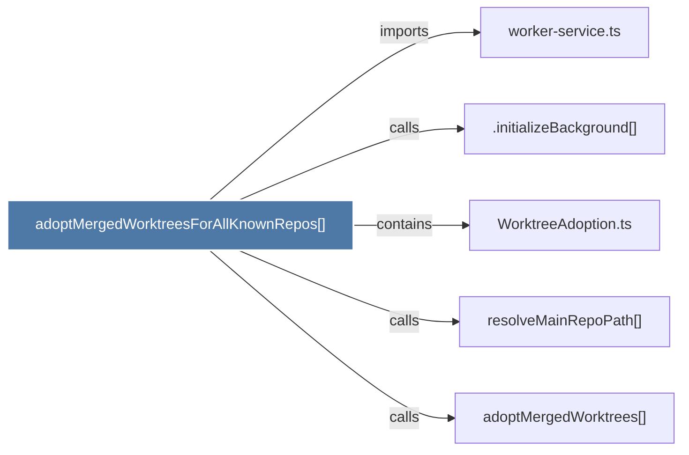

# adoptMergedWorktreesForAllKnownRepos()

> [!info] Properties
> **File Type**: code
> **Community**: [[_COMMUNITY_Community None|Community None]]
> **Degree**: 5

## Architecture Graph


## Outbound Connections
- [[.initializeBackground()]] - `calls` [INFERRED]
- [[WorktreeAdoption.ts]] - `contains` [EXTRACTED]
- [[adoptMergedWorktrees()]] - `calls` [EXTRACTED]
- [[resolveMainRepoPath()]] - `calls` [EXTRACTED]
- [[worker-service.ts]] - `imports` [EXTRACTED]

## Inbound Dependencies
> [!abstract]- Files that link here
```dataview
LIST
FROM [[adoptMergedWorktreesForAllKnownRepos()]]
```

#graphify/code #graphify/EXTRACTED #community/Community_None