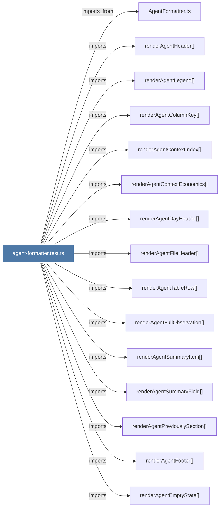

# agent-formatter.test.ts

> [!info] Properties
> **File Type**: code
> **Community**: [[_COMMUNITY_Community None|Community None]]
> **Degree**: 19

## Architecture Graph


## Outbound Connections
- [[AgentFormatter.ts]] - `imports_from` [EXTRACTED]
- [[createTestConfig()]] - `contains` [EXTRACTED]
- [[createTestEconomics()]] - `contains` [EXTRACTED]
- [[createTestObservation()_1]] - `contains` [EXTRACTED]
- [[renderAgentColumnKey()]] - `imports` [EXTRACTED]
- [[renderAgentContextEconomics()]] - `imports` [EXTRACTED]
- [[renderAgentContextIndex()]] - `imports` [EXTRACTED]
- [[renderAgentDayHeader()]] - `imports` [EXTRACTED]
- [[renderAgentEmptyState()]] - `imports` [EXTRACTED]
- [[renderAgentFileHeader()]] - `imports` [EXTRACTED]
- [[renderAgentFooter()]] - `imports` [EXTRACTED]
- [[renderAgentFullObservation()]] - `imports` [EXTRACTED]
- [[renderAgentHeader()]] - `imports` [EXTRACTED]
- [[renderAgentLegend()]] - `imports` [EXTRACTED]
- [[renderAgentPreviouslySection()]] - `imports` [EXTRACTED]
- [[renderAgentSummaryField()]] - `imports` [EXTRACTED]
- [[renderAgentSummaryItem()]] - `imports` [EXTRACTED]
- [[renderAgentTableRow()]] - `imports` [EXTRACTED]
- [[types.ts_12]] - `imports_from` [EXTRACTED]

## Inbound Dependencies
> [!abstract]- Files that link here
```dataview
LIST
FROM [[agent-formatter.test.ts]]
```

#graphify/code #graphify/EXTRACTED #community/Community_None