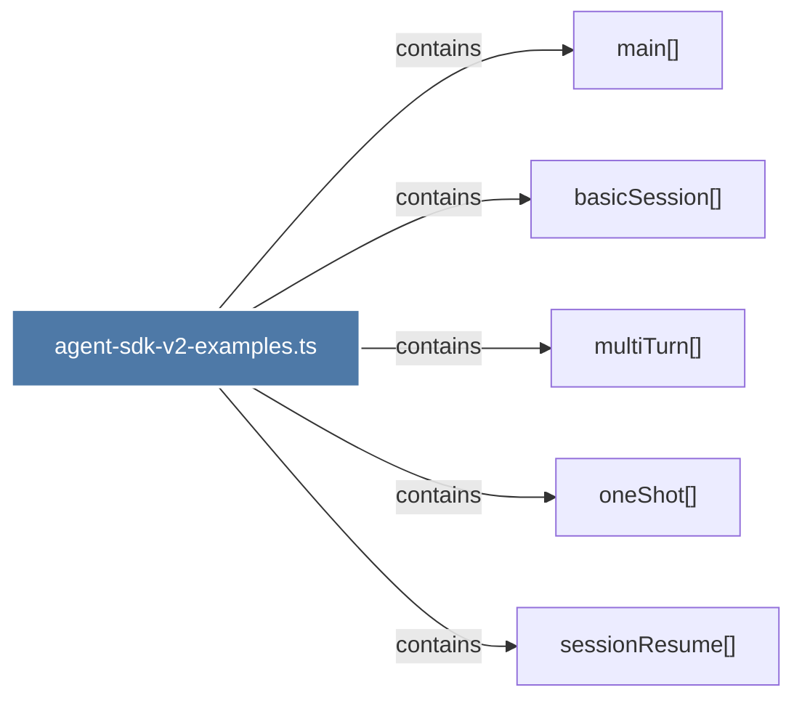

# agent-sdk-v2-examples.ts

> [!info] Properties
> **File Type**: code
> **Community**: [[_COMMUNITY_Community None|Community None]]
> **Degree**: 5

## Architecture Graph


## Outbound Connections
- [[basicSession()]] - `contains` [EXTRACTED]
- [[main()_19]] - `contains` [EXTRACTED]
- [[multiTurn()]] - `contains` [EXTRACTED]
- [[oneShot()]] - `contains` [EXTRACTED]
- [[sessionResume()]] - `contains` [EXTRACTED]

## Inbound Dependencies
> [!abstract]- Files that link here
```dataview
LIST
FROM [[agent-sdk-v2-examples.ts]]
```

#graphify/code #graphify/EXTRACTED #community/Community_None