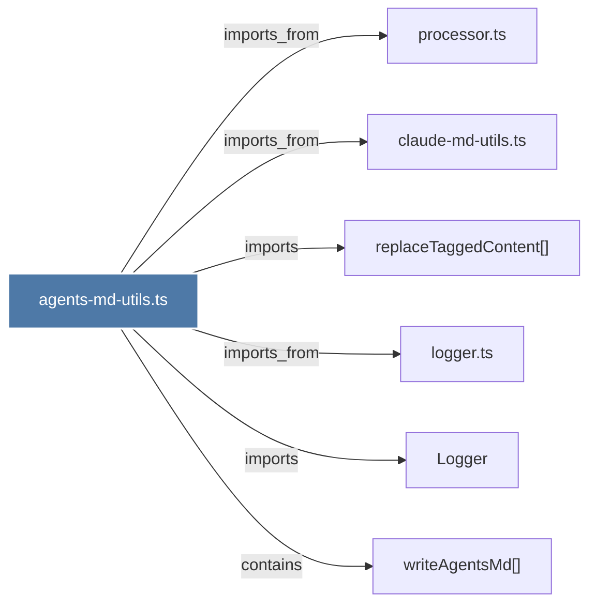

# agents-md-utils.ts

> [!info] Properties
> **File Type**: code
> **Community**: [[_COMMUNITY_Community None|Community None]]
> **Degree**: 6

## Architecture Graph


## Outbound Connections
- [[Logger]] - `imports` [EXTRACTED]
- [[claude-md-utils.ts]] - `imports_from` [EXTRACTED]
- [[logger.ts]] - `imports_from` [EXTRACTED]
- [[processor.ts]] - `imports_from` [EXTRACTED]
- [[replaceTaggedContent()]] - `imports` [EXTRACTED]
- [[writeAgentsMd()]] - `contains` [EXTRACTED]

## Inbound Dependencies
> [!abstract]- Files that link here
```dataview
LIST
FROM [[agents-md-utils.ts]]
```

#graphify/code #graphify/EXTRACTED #community/Community_None