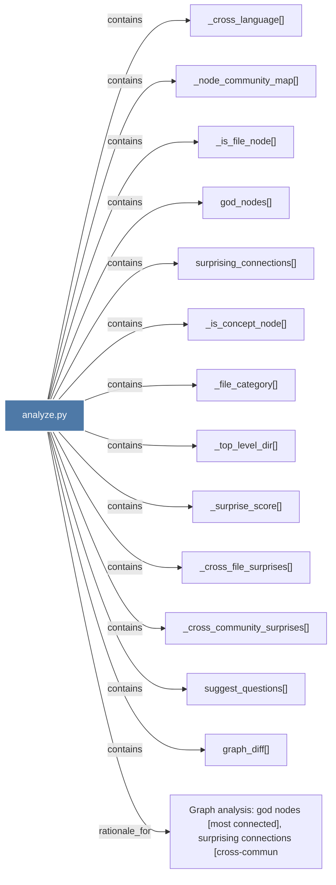

# analyze.py

> [!info] Properties
> **File Type**: code
> **Community**: [[_COMMUNITY_Community None|Community None]]
> **Degree**: 14

## Architecture Graph


## Outbound Connections
- [[Graph analysis god nodes (most connected), surprising connections (cross-commun]] - `rationale_for` [EXTRACTED]
- [[_cross_community_surprises()]] - `contains` [EXTRACTED]
- [[_cross_file_surprises()]] - `contains` [EXTRACTED]
- [[_cross_language()]] - `contains` [EXTRACTED]
- [[_file_category()]] - `contains` [EXTRACTED]
- [[_is_concept_node()]] - `contains` [EXTRACTED]
- [[_is_file_node()]] - `contains` [EXTRACTED]
- [[_node_community_map()]] - `contains` [EXTRACTED]
- [[_surprise_score()]] - `contains` [EXTRACTED]
- [[_top_level_dir()]] - `contains` [EXTRACTED]
- [[god_nodes()]] - `contains` [EXTRACTED]
- [[graph_diff()]] - `contains` [EXTRACTED]
- [[suggest_questions()]] - `contains` [EXTRACTED]
- [[surprising_connections()]] - `contains` [EXTRACTED]

## Inbound Dependencies
> [!abstract]- Files that link here
```dataview
LIST
FROM [[analyze.py]]
```

#graphify/code #graphify/EXTRACTED #community/Community_None