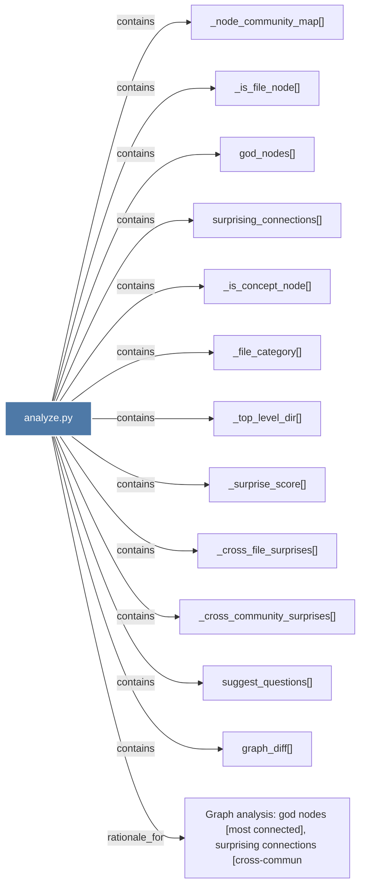

# analyze.py

> [!info] Properties
> **File Type**: code
> **Community**: [[_COMMUNITY_Community None|Community None]]
> **Degree**: 13

## Architecture Graph


## Outbound Connections
- [[Graph analysis god nodes (most connected), surprising connections (cross-commun_1]] - `rationale_for` [EXTRACTED]
- [[_cross_community_surprises()_1]] - `contains` [EXTRACTED]
- [[_cross_file_surprises()_1]] - `contains` [EXTRACTED]
- [[_file_category()_1]] - `contains` [EXTRACTED]
- [[_is_concept_node()_1]] - `contains` [EXTRACTED]
- [[_is_file_node()_1]] - `contains` [EXTRACTED]
- [[_node_community_map()_1]] - `contains` [EXTRACTED]
- [[_surprise_score()_1]] - `contains` [EXTRACTED]
- [[_top_level_dir()_1]] - `contains` [EXTRACTED]
- [[god_nodes()_1]] - `contains` [EXTRACTED]
- [[graph_diff()_1]] - `contains` [EXTRACTED]
- [[suggest_questions()_1]] - `contains` [EXTRACTED]
- [[surprising_connections()_1]] - `contains` [EXTRACTED]

## Inbound Dependencies
> [!abstract]- Files that link here
```dataview
LIST
FROM [[analyze.py_1]]
```

#graphify/code #graphify/EXTRACTED #community/Community_None