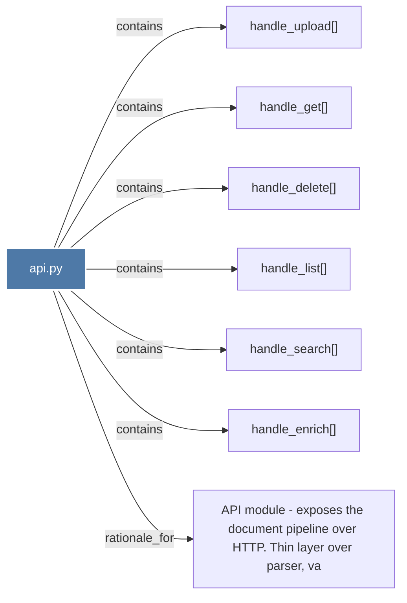

# api.py

> [!info] Properties
> **File Type**: code
> **Community**: [[_COMMUNITY_Community None|Community None]]
> **Degree**: 7

## Architecture Graph


## Outbound Connections
- [[API module - exposes the document pipeline over HTTP. Thin layer over parser, va]] - `rationale_for` [EXTRACTED]
- [[handle_delete()]] - `contains` [EXTRACTED]
- [[handle_enrich()]] - `contains` [EXTRACTED]
- [[handle_get()]] - `contains` [EXTRACTED]
- [[handle_list()]] - `contains` [EXTRACTED]
- [[handle_search()]] - `contains` [EXTRACTED]
- [[handle_upload()]] - `contains` [EXTRACTED]

## Inbound Dependencies
> [!abstract]- Files that link here
```dataview
LIST
FROM [[api.py]]
```

#graphify/code #graphify/EXTRACTED #community/Community_None