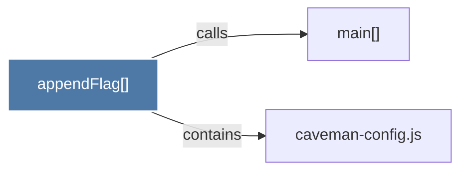

# appendFlag()

> [!info] Properties
> **File Type**: code
> **Community**: [[_COMMUNITY_Community None|Community None]]
> **Degree**: 2

## Architecture Graph


## Outbound Connections
- [[caveman-config.js]] - `contains` [EXTRACTED]
- [[main()_18]] - `calls` [INFERRED]

## Inbound Dependencies
> [!abstract]- Files that link here
```dataview
LIST
FROM [[appendFlag()]]
```

#graphify/code #graphify/INFERRED #community/Community_None