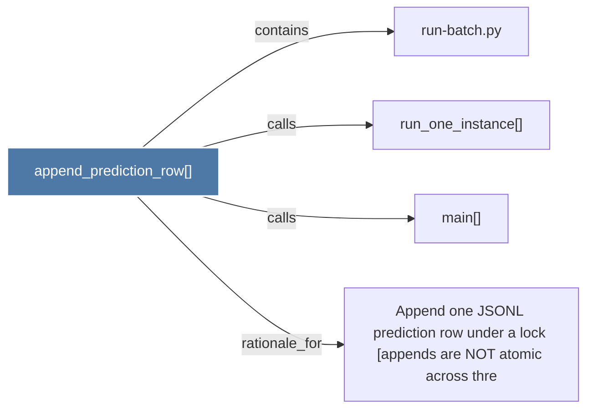

# append_prediction_row()

> [!info] Properties
> **File Type**: code
> **Community**: [[_COMMUNITY_Community None|Community None]]
> **Degree**: 4

## Architecture Graph


## Outbound Connections
- [[Append one JSONL prediction row under a lock (appends are NOT atomic across thre]] - `rationale_for` [EXTRACTED]
- [[main()_27]] - `calls` [EXTRACTED]
- [[run-batch.py]] - `contains` [EXTRACTED]
- [[run_one_instance()]] - `calls` [EXTRACTED]

## Inbound Dependencies
> [!abstract]- Files that link here
```dataview
LIST
FROM [[append_prediction_row()]]
```

#graphify/code #graphify/EXTRACTED #community/Community_None