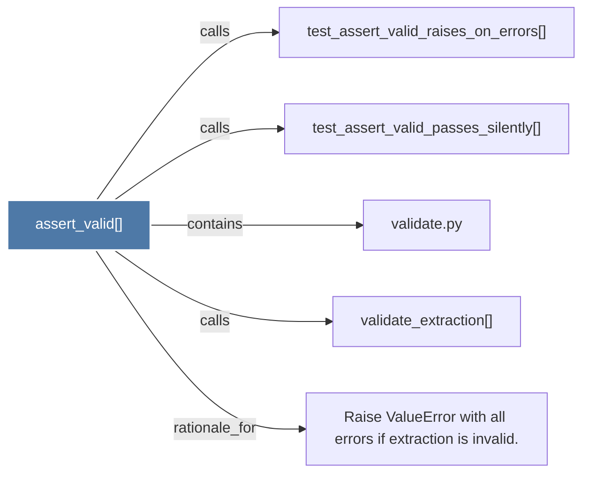

# assert_valid()

> [!info] Properties
> **File Type**: code
> **Community**: [[_COMMUNITY_Community None|Community None]]
> **Degree**: 5

## Architecture Graph


## Outbound Connections
- [[Raise ValueError with all errors if extraction is invalid.]] - `rationale_for` [EXTRACTED]
- [[test_assert_valid_passes_silently()]] - `calls` [INFERRED]
- [[test_assert_valid_raises_on_errors()]] - `calls` [INFERRED]
- [[validate.py]] - `contains` [EXTRACTED]
- [[validate_extraction()]] - `calls` [EXTRACTED]

## Inbound Dependencies
> [!abstract]- Files that link here
```dataview
LIST
FROM [[assert_valid()]]
```

#graphify/code #graphify/EXTRACTED #community/Community_None