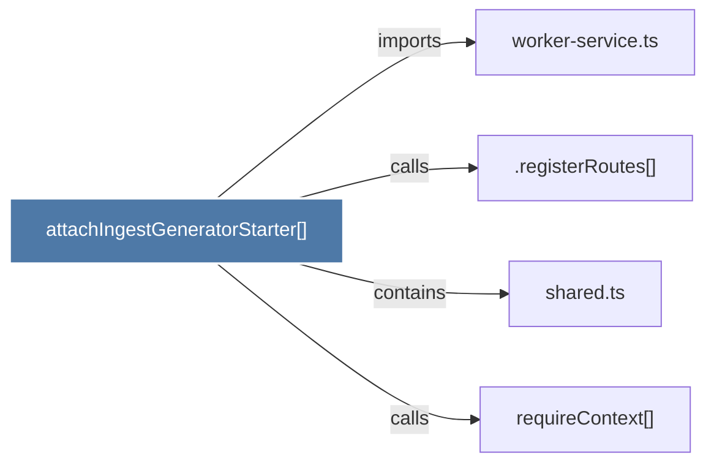

# attachIngestGeneratorStarter()

> [!info] Properties
> **File Type**: code
> **Community**: [[_COMMUNITY_Community None|Community None]]
> **Degree**: 4

## Architecture Graph


## Outbound Connections
- [[.registerRoutes()]] - `calls` [INFERRED]
- [[requireContext()]] - `calls` [EXTRACTED]
- [[shared.ts]] - `contains` [EXTRACTED]
- [[worker-service.ts]] - `imports` [EXTRACTED]

## Inbound Dependencies
> [!abstract]- Files that link here
```dataview
LIST
FROM [[attachIngestGeneratorStarter()]]
```

#graphify/code #graphify/EXTRACTED #community/Community_None