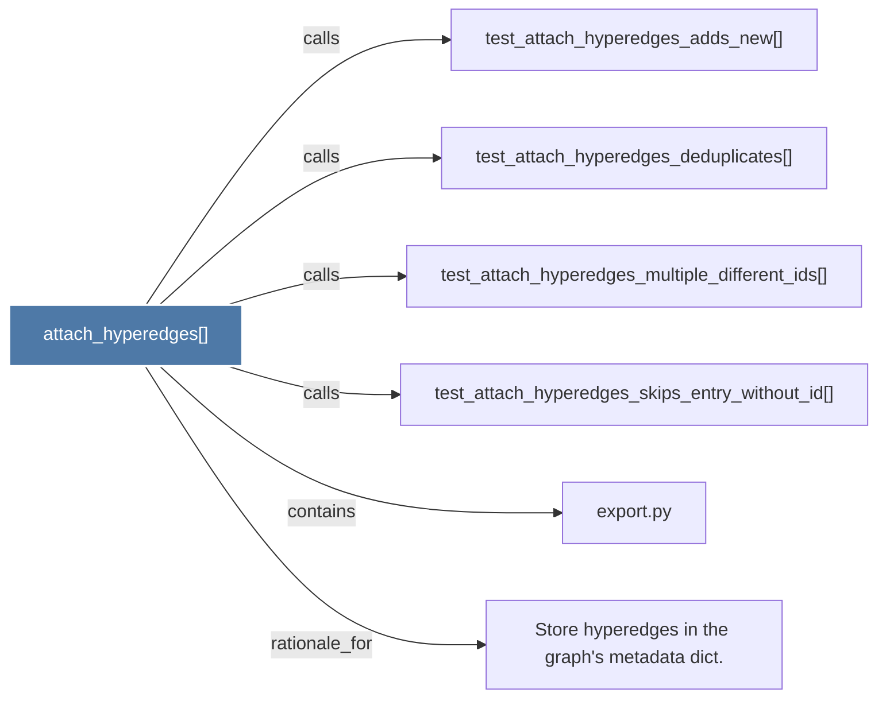

# attach_hyperedges()

> [!info] Properties
> **File Type**: code
> **Community**: [[_COMMUNITY_Community None|Community None]]
> **Degree**: 6

## Architecture Graph


## Outbound Connections
- [[Store hyperedges in the graph's metadata dict.]] - `rationale_for` [EXTRACTED]
- [[export.py]] - `contains` [EXTRACTED]
- [[test_attach_hyperedges_adds_new()]] - `calls` [INFERRED]
- [[test_attach_hyperedges_deduplicates()]] - `calls` [INFERRED]
- [[test_attach_hyperedges_multiple_different_ids()]] - `calls` [INFERRED]
- [[test_attach_hyperedges_skips_entry_without_id()]] - `calls` [INFERRED]

## Inbound Dependencies
> [!abstract]- Files that link here
```dataview
LIST
FROM [[attach_hyperedges()]]
```

#graphify/code #graphify/INFERRED #community/Community_None